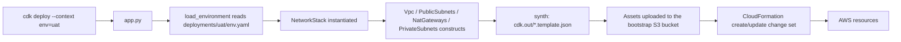

# Deployment Guide

How the app is wired together, how to deploy it, and where the remaining constructs go.

---

## 1. What is in the stack right now

`deployments/uat/env.yaml` currently produces **one** CloudFormation stack named
`int-production-use1-uat-network`, containing:

| Resource                            | Count | Created by                                                 |
| ----------------------------------- | ----- | ---------------------------------------------------------- |
| VPC (`10.20.0.0/16`)              | 1     | `constructs/vpc.py`                                      |
| Internet gateway + attachment       | 1     | `constructs/vpc.py`                                      |
| Public subnets (`edge`)           | 2     | `constructs/subnets.py`                                  |
| Private subnets (`app`, `data`) | 4     | `constructs/subnets.py`                                  |
| Route tables + associations         | 6     | created automatically per subnet                           |
| Default routes (IGW / NAT)          | 6     | `add_default_internet_route` / `add_default_nat_route` |
| Elastic IP + NAT gateway            | 1     | `constructs/nat_gateway.py`                              |

Stack outputs: `VpcId`, `PublicSubnetIdsEdge`, `PrivateSubnetIdsApp`, `PrivateSubnetIdsData`.

---

## 1a. Naming and tagging

### Names

`CommonProps.resource_name(*parts)` concatenates
`{account_name}-{region_prefix}-{parts...}`, the same order as the Terraform modules:

| Construct call | Resulting `Name` tag |
| --- | --- |
| `resource_name(network.name, "vpc")` | `int-production-use1-uat-vpc` |
| `resource_name(network.name, "igw")` | `int-production-use1-uat-igw` |
| `resource_name(vpc_name, group, "public", ordinal)` | `int-production-use1-uat-edge-public-primary` |
| `resource_name(vpc_name, group, "private", ordinal)` | `int-production-use1-uat-app-private-secondary` |
| route table (derived) | `int-production-use1-uat-app-private-secondary-rtb` |
| `resource_name(vpc_name, ordinal, "natgw")` | `int-production-use1-uat-primary-natgw` |

`account_name` and `region_prefix` come from `common:` in the config file; the third
segment is the `networks[].name` value. So `name: uat` is what turns the VPC into
`int-production-use1-uat-vpc`.

The `primary` / `secondary` / `tertiary` / `quaternary` words come from
`src/cognitech_cdk/common/naming.py`, so subnet names match the Terraform modules even though
the config uses a list instead of four separate variables.

### Common tags

Terraform merges `var.common.tags` into every resource. CDK does it once, in the stack
constructor:

```python
for key, value in common.tags.items():
    cdk.Tags.of(self).add(key, value)
```

`Tags.of(scope)` is an Aspect: it walks the whole construct tree below that scope and adds
the tag to every taggable resource — VPC, subnets, route tables, NAT gateways, EIPs, and
anything you add later. You never repeat tags in individual constructs.

```yaml
common:
  account_name: int-production
  region_prefix: use1
  tags:
    Build-method: aws-cdk
    Environment: user-acceptance-test
    ManagedBy: aws-cdk/cognitech-AWS-CDK-repo-int-production-Tenant-account-uat-primary
    Owner: kbrigthain@gmail.com
    Compliance: hippaa
```

**`Name` is not a common tag.** Its value differs per resource, so each construct sets it
with `Tags.of(resource).add("Name", ...)`. Tags applied deeper in the tree win over tags
applied higher up, which is why the per-resource `Name` overrides anything inherited — and
why a route table can be renamed to `...-rtb` even though it lives inside the subnet
construct. `load_environment` raises if a config puts `Name` in `common.tags`, or omits any
of `Build-method`, `Environment`, `ManagedBy`, `Owner`, `Compliance`.

To tag only part of the tree, scope it narrower:

```python
cdk.Tags.of(self.private_subnets["data"]).add("DataClassification", "phi")
cdk.Tags.of(self).add("Backup", "daily", exclude_resource_types=["AWS::EC2::RouteTable"])
```

---

## 2. How a deploy actually flows



Key points:

- **`--context env=uat` is the only switch between environments.** It selects
  `deployments/uat/env.yaml`, which carries the account ID, region, naming prefixes, tags, and CIDRs.
- **There is no state file.** CloudFormation tracks what exists. `cdk diff` reads the
  deployed template and compares it with the freshly synthesized one.
- **Logical IDs come from the construct tree path.** Renaming a construct ID (the second
  argument, e.g. `"Network"`) renames the logical ID, and CloudFormation will **replace**
  the resource. Treat those strings as stable identifiers, like Terraform resource addresses.

---

## 3. One-time setup

### 3.1 Local toolchain

```powershell
cd C:\Users\Owner\Downloads\GitRepos\cognitech-repos\cognitech-AWS-CDK-repo
python -m venv .venv
.\.venv\Scripts\Activate.ps1
pip install -r requirements-dev.txt
npm install -g aws-cdk@2
cdk --version
```

### 3.2 Point the config at a real account

Edit `deployments/uat/env.yaml`:

```yaml
account_id: "111122223333"   # must match the credentials you deploy with
region: us-east-1
common:
  account_name: int-production
  region_prefix: use1
```

If `account_id` does not match your credentials, CDK stops with
`Need to perform AWS calls for account X, but the current credentials are for Y`.
This is intentional — it prevents deploying uat config into the prod account.

### 3.3 Bootstrap the account/region

Run once per account **and** per region, with administrative credentials:

```powershell
cdk bootstrap aws://111122223333/us-east-1 --profile <your-sso-profile>
```

This creates the `CDKToolkit` CloudFormation stack: an S3 asset bucket, an ECR repo, and
five `cdk-hnb659fds-*` IAM roles (deploy, file-publishing, image-publishing, lookup, and
the CloudFormation execution role). It is the CDK equivalent of your
`Cloudformation/Initializing-account-for-terraform` templates.

---

## 4. Deploying manually

```powershell
# 1. List the stacks the app will produce
cdk ls --context env=uat
#    -> int-production-use1-uat-network

# 2. Validate: unit tests run against the synthesized template
pytest -q

# 3. Render the CloudFormation template without touching AWS
cdk synth --context env=uat                 # prints YAML; also writes cdk.out/

# 4. Compare against what is deployed  (the `terraform plan` equivalent)
cdk diff --context env=uat --profile <your-sso-profile>

# 5. Deploy
cdk deploy --all --context env=uat --profile <your-sso-profile>
```

Useful flags:

| Flag                         | Purpose                                                           |
| ---------------------------- | ----------------------------------------------------------------- |
| `--require-approval never` | skip the interactive prompt for IAM/security changes (used in CI) |
| `--progress events`        | stream CloudFormation events instead of the spinner               |
| `--exclusively` / `-e`   | deploy only the named stack, not its dependencies                 |
| `--outputs-file out.json`  | write stack outputs to a file                                     |
| `--hotswap`                | dev-only fast path;**never** use against prod               |

Deploying prod is the same command with a different context:

```powershell
cdk deploy --all --context env=prod --profile <your-prod-profile>
```

### Tearing down

```powershell
cdk destroy --all --context env=uat --profile <your-sso-profile>
```

---

## 5. Deploying through GitHub Actions

Pipelines never use static AWS keys; they exchange a GitHub OIDC token for a role.

| Trigger                             | Workflow                             | What it does                                                                              |
| ----------------------------------- | ------------------------------------ | ----------------------------------------------------------------------------------------- |
| Pull request to`main`             | `.github/workflows/cdk-pr.yml`     | pytest once, then `cdk synth` + `cdk diff` for each affected environment, commented on the PR |
| Push to`main`, or manual dispatch | `.github/workflows/cdk-deploy.yml` | deploys only the affected environments, in `deploy_order`, one at a time                             |

### How environments are selected

Neither workflow hard-codes an environment list. A `select` job runs
`scripts/select_environments.py`, which:

1. lists every `deployments/*/env.yaml` and sorts them by `deploy_order`;
2. diffs the push or PR against its base;
3. returns **all** environments if shared code changed (`src/`, `app.py`, `cdk.json`,
   `requirements*`, `scripts/`), otherwise only the environments whose
   `deployments/<env>/` folder changed.

The JSON it prints becomes the deploy job's matrix, and each matrix entry sets
`environment: ${{ matrix.environment }}` so the matching **GitHub Environment** protection
rules apply. Adding `deployments/staging/env.yaml` plus a `staging` GitHub Environment is
all it takes to get a new pipeline target — no workflow edits.

`workflow_dispatch` accepts an environment name, or `all`.

Both deploy jobs call the shared composite action at
`.github/actions/cdk-deploy/action.yml`, so the install/test/assume-role/deploy sequence is
defined once.

Required configuration:

| Where                      | Name                       | Value                                  |
| -------------------------- | -------------------------- | -------------------------------------- |
| Repo secret                | `AWS_PLAN_ROLE_ARN_UAT`  | read-only role ARN in the uat account  |
| Repo secret                | `AWS_PLAN_ROLE_ARN_PROD` | read-only role ARN in the prod account |
| Environment`uat` secret  | `AWS_DEPLOY_ROLE_ARN`    | deploy role ARN in the uat account     |
| Environment`prod` secret | `AWS_DEPLOY_ROLE_ARN`    | deploy role ARN in the prod account    |
| Repo variable              | `AWS_REGION`             | e.g.`us-east-1`                      |

The **plan** role needs `ReadOnlyAccess` plus `sts:AssumeRole` on
`cdk-hnb659fds-lookup-role-*`. The **deploy** role only needs `sts:AssumeRole` on the
`cdk-hnb659fds-*-role-*` bootstrap roles — the actual resource permissions live on the
CloudFormation execution role created by `cdk bootstrap`.

Add required reviewers to the `prod` GitHub Environment so production waits for approval.

---

## 6. Where the remaining constructs go

Everything reusable goes in `src/cognitech_cdk/constructs/`, one file per Terraform module.
Stacks in `src/cognitech_cdk/stacks/` group constructs into deployment units — roughly one
stack per lifecycle, so that a change to a load balancer does not re-evaluate the VPC.

```
src/cognitech_cdk/
  common/
    config.py          # schema for every construct's inputs (variables.tf equivalent)
    naming.py
  constructs/          # <- all new "modules" land here
    vpc.py             # done
    subnets.py         # done
    nat_gateway.py     # done
    security_group.py  # next
    vpc_endpoints.py
    transit_gateway.py
    ...
  stacks/              # <- deployment units that call the constructs
    network_stack.py   # done
    security_stack.py
    edge_stack.py
    data_stack.py
    compute_stack.py
    platform_stack.py

deployments/           # <- one folder per environment, nothing but values
  uat/env.yaml
  prod/env.yaml
```

Planned mapping from the Terraform repo:

| Terraform module                                                                                    | New construct file                                     | Stack it belongs to   |
| --------------------------------------------------------------------------------------------------- | ------------------------------------------------------ | --------------------- |
| `vpc`, `subnets`, `Routes`, `natgateway`                                                    | done                                                   | `network_stack.py`  |
| `VPCEndpoints`                                                                                    | `constructs/vpc_endpoints.py`                        | `network_stack.py`  |
| `Transit-gateway*`                                                                                | `constructs/transit_gateway.py`                      | `network_stack.py`  |
| `Security-group`, `Security-group-rules`                                                        | `constructs/security_group.py`                       | `security_stack.py` |
| `WAF`, `WAF-rulegroup`, `Waf-ipsets`                                                          | `constructs/waf.py`                                  | `security_stack.py` |
| `IAM-Roles`, `IAM-Policies`, `EC2-profiles`                                                   | `constructs/iam.py`                                  | `platform_stack.py` |
| `SSM-Parameter-store`, `Secrets-manager`                                                        | `constructs/parameters.py`                           | `platform_stack.py` |
| `ECR`, `S3-Private-bucket`                                                                      | `constructs/ecr.py`, `constructs/s3_bucket.py`     | `platform_stack.py` |
| `Load-Balancers`, `alb-listeners`, `Target-groups`, `ACM-Public-Certs`, `Route-53-*`      | `constructs/load_balancer.py`, `constructs/dns.py` | `edge_stack.py`     |
| `RDS`, `Dynamodbtable`, `AWSEFS`, `AWS-OpenSearch`                                          | one file each                                          | `data_stack.py`     |
| `EC2-instance`, `Launch_template`, `AutoScaling`, `Deploy-ecs`, `Deploy-eks`, `Lambdas` | one file each                                          | `compute_stack.py`  |

### The recipe for adding one

1. **Schema** — add a dataclass to `src/cognitech_cdk/common/config.py` and parse it in
   `load_environment`, then add the matching keys to every `deployments/<env>/env.yaml`.
2. **Construct** — new file in `src/cognitech_cdk/constructs/`. It subclasses `Construct`,
   takes `common: CommonProps` plus its own typed props as keyword-only arguments, names its
   resources with `common.resource_name(...)`, and exposes the IDs or L2 objects that other
   constructs need. Do **not** re-apply common tags — the stack already did.
3. **Stack** — instantiate it from an existing stack, or add a new stack class and register
   it in `app.py`.
4. **Test** — add assertions in `tests/unit/`.

### Passing values between constructs and stacks

Inside one stack, just pass the Python object or its `.vpc_id`; CDK emits `Ref` /
`Fn::GetAtt` for you. Between stacks in the same app, pass the construct object into the
second stack's constructor — CDK creates the CloudFormation export/import and orders the
deployments automatically. That replaces your Terraform `acquire-state` module:

```python
network = NetworkStack(app, "...-network", common=..., network=..., env=aws_env)

ComputeStack(
    app,
    "...-compute",
    common=config.common,
    vpc=network.network.vpc,
    private_subnets=network.private_subnets["app"].subnets,
    env=aws_env,
)
```

Avoid circular references between stacks — if two stacks need each other, the shared piece
belongs in a third stack or in SSM Parameter Store.
