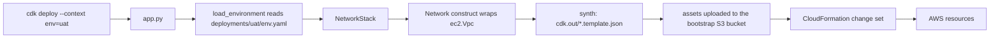

# Deployment Guide

How the app is wired together, how to deploy it, and where new constructs go.

---

## 1. What is in the stack right now

`app.py` creates one stack per entry under `networks:`. `deployments/uat/env.yaml` declares
two, so `cdk ls --context env=uat` prints:

```
int-production-use1-cdk-uat-network
int-production-use1-cdk-dmz-network
```

`uat` — explicit CIDRs across two AZs:

| Resource | Count | Notes |
| -------- | ----- | ----- |
| VPC (`10.20.0.0/16`) | 1 | DNS hostnames and support enabled |
| Internet gateway + attachment | 1 | |
| Subnets | 6 | `edge` public, `app` private, `data` isolated, x2 AZs |
| Route tables + associations | 6 | one per subnet |
| Default routes | 4 | IGW for `edge`, NAT for `app`; `data` has none |
| Elastic IP + NAT gateway | 1 | `nat_gateways: 1` |

`dmz` — public only, so no NAT gateways and no Elastic IPs at all:

| Resource | Count |
| -------- | ----- |
| VPC (`10.21.0.0/16`) | 1 |
| Internet gateway + attachment | 1 |
| Public subnets | 2 |
| Route tables + default routes | 2 |

Prod uses the other style — `az_count: 3` and `cidr_mask: 20` — so the same code carves the
ranges and produces 9 subnets with one NAT gateway per AZ.

Outputs per stack: `VpcId`, plus `SubnetIds<Group>` for each subnet group.

---

## 2. How a deploy flows



Key points:

- **`--context env=uat` is the only switch between environments.** It selects
  `deployments/uat/env.yaml`, which carries the account ID, region, naming prefixes, tags,
  and the network shape.
- **There is no state file.** CloudFormation tracks what exists; `cdk diff` compares the
  deployed template with the freshly synthesized one.
- **Logical IDs come from the construct tree path.** Renaming a construct ID (the second
  argument, e.g. `"Network"`) renames the logical ID, and CloudFormation will **replace**
  the resource. Treat those strings as stable identifiers.

---

## 3. Naming and tagging

### Names

`CommonProps.resource_name(*parts)` concatenates
`{account_name}-{region_prefix}-{qualifier}-{parts...}`. Empty segments are skipped.

| Resource | Name |
| -------- | ---- |
| VPC | `int-production-use1-cdk-uat-vpc` |
| Internet gateway | `int-production-use1-cdk-uat-igw` |
| Public subnet | `int-production-use1-cdk-uat-edge-public-primary` |
| Private subnet | `int-production-use1-cdk-uat-app-private-secondary` |
| Route table | `int-production-use1-cdk-uat-app-private-secondary-rtb` |
| NAT gateway | `int-production-use1-cdk-uat-primary-natgw` |
| Elastic IP | `int-production-use1-cdk-uat-primary-nat-eip` |

The `primary` / `secondary` / `tertiary` words come from
`src/cognitech_cdk/common/naming.py` and follow the availability-zone order declared in the
environment file.

### Telling CDK resources apart from Terraform ones

`qualifier: cdk` inserts a segment marking every resource as CDK-built. That matters beyond
readability: resources with **unique name constraints** — ALBs, target groups, IAM roles,
security group names, S3 buckets, ECS clusters — would otherwise collide while the
Terraform and CDK estates run side by side.

Two more differentiators you get for free: the `Build-method: aws-cdk` tag, and the
`aws:cloudformation:stack-name` / `stack-id` / `logical-id` tags CloudFormation applies
automatically.

Keep the qualifier short. ALB and target group names cap at 32 characters and
`int-production-use1-cdk-uat-app-private-primary` is already 47, so plan to shorten
`account_name` before adding those resource types.

### Common tags

Applied once, in the stack constructor:

```python
for key, value in common.tags.items():
    cdk.Tags.of(self).add(key, value)
```

`Tags.of(scope)` is an Aspect: it walks the whole construct tree below that scope and tags
every taggable resource. You never repeat tags in individual constructs.

**`Name` is not a common tag** — its value differs per resource. Tags applied deeper in the
tree win over tags applied higher up, which is why a per-resource `Name` overrides the
inherited one, and why a route table can be renamed to `...-rtb` even though it lives
inside the subnet. `load_environment` raises if a config puts `Name` in `common.tags` or
omits any of `Build-method`, `Environment`, `ManagedBy`, `Owner`, `Compliance`.

To tag only part of the tree, scope it narrower:

```python
cdk.Tags.of(self.network.vpc).add("Backup", "daily")
```

---

## 4. One-time setup

### 4.1 Local toolchain

`cdk.json` runs the app with `python app.py`. **Always work inside an activated virtual
environment** — that is what puts a plain `python` on `PATH`. Ubuntu/WSL ships `python3`
only, so an unactivated shell fails with:

```
/bin/sh: 1: python: not found
python app.py: Subprocess exited with error 127
```

A venv created on Windows cannot be used from WSL and vice versa (one has
`Scripts/python.exe`, the other `bin/python`). Keep one per platform; both are gitignored.

**Windows (PowerShell):**

```powershell
cd C:\Users\Owner\Downloads\GitRepos\cognitech-repos\cognitech-AWS-CDK-repo
python -m venv .venv
.\.venv\Scripts\Activate.ps1
pip install -r requirements-dev.txt
npm install -g aws-cdk@2
cdk --version
```

**WSL / Linux (bash):**

```bash
cd /mnt/c/Users/Owner/Downloads/GitRepos/cognitech-repos/cognitech-AWS-CDK-repo
python3 -m venv .venv-linux
source .venv-linux/bin/activate
pip install -r requirements-dev.txt
npm install -g aws-cdk@2
cdk --version
```

Your prompt should start with `(.venv)` or `(.venv-linux)`. A prefix like `(admin-mdpp)` is
an AWS profile, not a virtual environment. Verify before running any `cdk` command:

```bash
which python && python --version   # must resolve inside the venv
```

**Node version.** The CDK CLI warns that the AWS SDK for JavaScript will require
`node >= 22` from January 2027. Node 20 still works today, but upgrade when convenient:

```bash
# nvm
nvm install 22 && nvm use 22 && npm install -g aws-cdk@2
```

Keep the CLI current too — `npm install -g aws-cdk@2` when it reports a newer version.
The CLI is independent of the `aws-cdk-lib` version pinned in `requirements.txt`.

### 4.2 Point the config at a real account

Edit `deployments/uat/env.yaml`:

```yaml
account_id: "111122223333"   # must match the credentials you deploy with
region: us-east-1
```

If `account_id` does not match your credentials, CDK stops with
`Need to perform AWS calls for account X, but the current credentials are for Y`. That is
intentional — it prevents deploying uat config into the prod account.

Confirm which account your credentials resolve to:

```bash
aws sts get-caller-identity --profile <your-profile>
```

### 4.3 Bootstrap the account/region

Run once per account **and** region, with administrative credentials, from an activated
venv:

```bash
cdk bootstrap aws://111122223333/us-east-1 --profile <your-sso-profile>
```

This creates the `CDKToolkit` stack: an S3 asset bucket, an ECR repo, and five
`cdk-hnb659fds-*` IAM roles. Repeat for every account and region you deploy into — the uat
account, the prod account, and any secondary region.

Useful options:

| Flag | Purpose |
| ---- | ------- |
| `--qualifier <10-char>` | isolate this bootstrap from an existing one; must then be set as `@aws-cdk/core:bootstrapQualifier` in `cdk.json` |
| `--cloudformation-execution-policies` | restrict what deploys may do (defaults to `AdministratorAccess`) |
| `--trust <account-id>` | let another account deploy here, for a central pipeline account |
| `--show-template` | print the bootstrap template instead of deploying it |

Verify it afterwards:

```bash
aws cloudformation describe-stacks --stack-name CDKToolkit \
  --query 'Stacks[0].StackStatus' --profile <your-sso-profile>
```

#### Bootstrap troubleshooting

| Symptom | Cause and fix |
| ------- | ------------- |
| `/bin/sh: 1: python: not found` / `Subprocess exited with error 127` | No activated venv, or a Windows venv being used from WSL. See 4.1. |
| `ModuleNotFoundError: No module named 'yaml'` | Venv activated but dependencies not installed: `pip install -r requirements-dev.txt`. |
| `Need to perform AWS calls for account X, but the current credentials are for Y` | `account_id` in the environment file does not match your profile. |
| `ExpiredToken` / `InvalidClientTokenId` | Refresh SSO: `aws sso login --profile <your-profile>`. |
| `NodeVersionSupportWarning` | Harmless today; upgrade to node 22 before January 2027. |
| `Newer version of CDK is available` | `npm install -g aws-cdk@2`. |

---

## 5. Deploying manually

```bash
cdk ls --context env=uat
#   -> int-production-use1-cdk-uat-network
#      int-production-use1-cdk-dmz-network

pytest -q
cdk synth  --context env=uat
cdk diff   --context env=uat --profile <your-sso-profile>
cdk deploy --all --context env=uat --profile <your-sso-profile>
```

| Flag | Purpose |
| ---- | ------- |
| `--require-approval never` | skip the prompt for IAM/security changes (used in CI) |
| `--progress events` | stream CloudFormation events |
| `--exclusively` / `-e` | deploy only the named stack |
| `--outputs-file out.json` | write stack outputs to a file |
| `--hotswap` | non-production fast path; never use against prod |

Tear down with `cdk destroy --all --context env=uat`.

---

## 6. Deploying through GitHub Actions

Pipelines never use static AWS keys; they exchange a GitHub OIDC token for a role.

| Trigger | Workflow | What it does |
| ------- | -------- | ------------ |
| Pull request to `main` | `cdk-pr.yml` | pytest once, then `cdk synth` + `cdk diff` per affected environment, commented on the PR |
| Push to `main`, or manual dispatch | `cdk-deploy.yml` | deploys the affected environments, in `deploy_order`, one at a time |

### How environments are selected

Neither workflow hard-codes an environment list. A `select` job runs
`scripts/select_environments.py`, which:

1. lists every `deployments/*/env.yaml` and sorts by `deploy_order`;
2. diffs the push or PR against its base;
3. returns **all** environments if shared code changed (`src/`, `app.py`, `cdk.json`,
   `requirements*`, `scripts/`), otherwise only those whose `deployments/<env>/` folder
   changed.

The JSON it prints becomes the deploy job's matrix, and each entry sets
`environment: ${{ matrix.environment }}` so the matching GitHub Environment protection
rules apply. Adding `deployments/staging/env.yaml` plus a `staging` GitHub Environment is
all it takes to get a new pipeline target.

`workflow_dispatch` accepts an environment name, or `all`.

Both deploy jobs call the composite action at `.github/actions/cdk-deploy/action.yml`, so
the install/test/assume-role/deploy sequence is defined once.

### Required configuration

| Where | Name | Value |
| ----- | ---- | ----- |
| Repo secret | `AWS_PLAN_ROLE_ARN_UAT` | read-only role ARN in the uat account |
| Repo secret | `AWS_PLAN_ROLE_ARN_PROD` | read-only role ARN in the prod account |
| Environment `uat` secret | `AWS_DEPLOY_ROLE_ARN` | deploy role ARN in the uat account |
| Environment `prod` secret | `AWS_DEPLOY_ROLE_ARN` | deploy role ARN in the prod account |
| Repo variable | `AWS_REGION` | e.g. `us-east-1` |

The **plan** role needs `ReadOnlyAccess` plus `sts:AssumeRole` on
`cdk-hnb659fds-lookup-role-*`. The **deploy** role only needs `sts:AssumeRole` on the
`cdk-hnb659fds-*-role-*` bootstrap roles — the real resource permissions live on the
CloudFormation execution role created by `cdk bootstrap`.

Add required reviewers to the `prod` GitHub Environment so production waits for approval.

---

## 7. Where new constructs go

Reusable building blocks go in `src/cognitech_cdk/constructs/`. Stacks in
`src/cognitech_cdk/stacks/` group them into deployment units — roughly one stack per
lifecycle, so a load balancer change does not re-evaluate the VPC.

```
src/cognitech_cdk/
  common/
    config.py          # schema for every construct's inputs
    naming.py
  constructs/          # <- new building blocks land here
    network.py         # done
    security_group.py  # next
    ...
  stacks/              # <- deployment units
    network_stack.py   # done
    security_stack.py
    edge_stack.py
    data_stack.py
    compute_stack.py
    platform_stack.py

deployments/           # <- one folder per environment, values only
  uat/env.yaml
  prod/env.yaml
```

Suggested grouping:

| Stack | Holds |
| ----- | ----- |
| `network_stack.py` | VPC, subnets, VPC endpoints, transit gateway attachments |
| `security_stack.py` | security groups, WAF |
| `platform_stack.py` | IAM roles and policies, SSM parameters, secrets, ECR |
| `edge_stack.py` | ALB/NLB, target groups, ACM certificates, Route 53 |
| `data_stack.py` | RDS, DynamoDB, EFS, OpenSearch |
| `compute_stack.py` | EC2, launch templates, ASGs, ECS, EKS, Lambda |

### The recipe

1. **Schema** — add a dataclass to `src/cognitech_cdk/common/config.py`, parse it in
   `load_environment`, and add the keys to every `deployments/<env>/env.yaml`.
2. **Construct** — new file in `src/cognitech_cdk/constructs/`, subclassing `Construct`,
   taking `common: CommonProps` plus its own typed props as keyword-only arguments, naming
   resources with `common.resource_name(...)`. Prefer L2 constructs and let CDK generate
   the supporting resources. Do not re-apply common tags.
3. **Stack** — instantiate it from an existing stack, or add a new stack class and register
   it in `app.py`.
4. **Test** — add assertions in `tests/unit/`.

### Passing values around

Inside one stack, pass the object or its `.vpc_id`; CDK emits `Ref` / `Fn::GetAtt`. Between
stacks, pass the construct object into the second stack's constructor — CDK creates the
export/import and orders the deployments:

```python
network = NetworkStack(app, "...-network", common=..., network=..., env=aws_env)

ComputeStack(
    app,
    "...-compute",
    common=config.common,
    vpc=network.network.vpc,
    env=aws_env,
)
```

Because `network.network.vpc` is a full `ec2.IVpc`, downstream constructs can take it
directly. Subnets are created explicitly rather than through `ec2.Vpc`'s
`subnet_configuration`, so `vpc.select_subnets()` is empty — use the `Network` helpers
instead, which return the same thing any L2 expects:

```python
ec2.Vpc  # not used for subnet selection
network.network.subnets("app")      # list[ec2.Subnet]
network.network.subnet_ids("app")   # list[str]
network.network.selection("app")    # ec2.SubnetSelection, for vpc_subnets=
```

Avoid circular references between stacks; if two stacks need each other, the shared piece
belongs in a third stack or in SSM Parameter Store.
