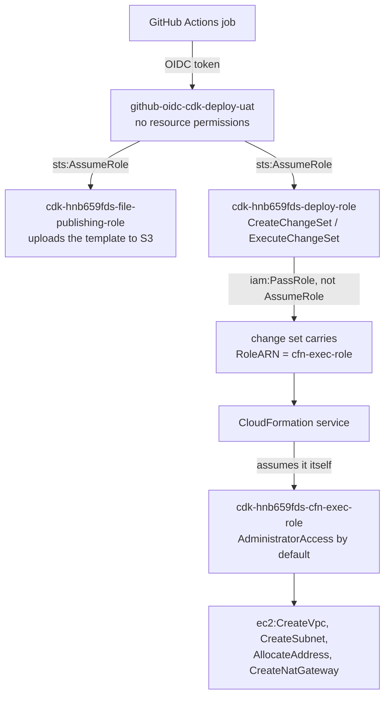

# Deployment Guide

This repo deploys one VPC per environment: public subnets and an internet gateway, plus
optional private subnets with NAT gateways and Elastic IPs. You choose how many
availability zones.

---

## 1. What gets created

| Always                         | Only when `private_subnets: true` |
| ------------------------------ | --------------------------------- |
| VPC                            | One private subnet per AZ         |
| One public subnet per AZ       | NAT gateway(s)                    |
| Internet gateway               | One Elastic IP per NAT gateway    |
| Route table per subnet         | Default route to the NAT gateway  |
| Default route to the IGW       |                                   |

Each stack outputs `VpcId`, `PublicSubnetIds`, and `PrivateSubnetIds` when private subnets
are on.

The code is two files:

| File                                   | Does                                        |
| -------------------------------------- | ------------------------------------------- |
| `src/cognitech_cdk/settings.py`        | reads and validates `env.yaml`              |
| `src/cognitech_cdk/network_stack.py`   | the VPC, subnets, gateways, tags, outputs   |

`app.py` ties them together: `--context env=<name>` picks the folder under `deployments/`.

---

## 2. Configuring an environment

One file per environment: `deployments/<env>/env.yaml`. All keys are flat.

```yaml
account_id: "111122223333"
region: us-east-1
deploy_order: 10

name_prefix: int-production-use1-cdk-uat

cidr: 10.20.0.0/16
azs: 2

private_subnets: true
nat_gateways: 1

tags:
  Build-method: aws-cdk
  Environment: user-acceptance-test
  ManagedBy: aws-cdk/cognitech-AWS-CDK-repo
  Owner: kbrigthain@gmail.com
  Compliance: hippaa
```

| Key               | Required | Default           | Meaning                                           |
| ----------------- | -------- | ----------------- | ------------------------------------------------- |
| `account_id`      | yes      | —                 | Must match the credentials you deploy with        |
| `region`          | yes      | —                 | e.g. `us-east-1`                                  |
| `deploy_order`    | no       | `100`             | Lower numbers deploy first in the pipeline        |
| `name_prefix`     | yes      | —                 | Prefix for every resource name                    |
| `cidr`            | yes      | —                 | The VPC range                                     |
| `azs`             | no       | `2`               | **1, 2 or 3** availability zones                  |
| `private_subnets` | no       | `false`           | Add private subnets + NAT gateways + Elastic IPs  |
| `nat_gateways`    | no       | one per AZ        | Only used when `private_subnets: true`            |
| `tags`            | yes      | —                 | Needs `Build-method`, `Environment`, `ManagedBy`, `Owner`, `Compliance` |

### 2.1 A VPC with no NAT gateways

Leave `private_subnets` out, or set it to `false`. Nothing else to change — you get a VPC,
public subnets and an internet gateway, and **no NAT gateways and no Elastic IPs**:

```yaml
cidr: 10.40.0.0/16
azs: 2
private_subnets: false
```

→ 1 VPC, 2 public subnets, 1 internet gateway, 2 route tables, 2 default routes.

### 2.2 Adding private subnets

```yaml
cidr: 10.20.0.0/16
azs: 2
private_subnets: true
nat_gateways: 1     # omit for one per AZ
```

→ the above, plus 2 private subnets, 1 NAT gateway, 1 Elastic IP, and a default route from
both private subnets to that NAT gateway.

`nat_gateways: 1` is the cheap option: one NAT gateway serves every private subnet, but a
zone outage takes out egress for the others. Omitting the key gives one per AZ, which is
what `prod` uses. Setting `private_subnets: true` with `nat_gateways: 0` is rejected —
private subnets with no NAT gateway would have no route out at all.

### 2.3 Choosing the number of AZs

`azs` is `1`, `2` or `3`. Anything else is rejected.

| `azs` | Zones                                  | Subnets (public only) | Subnets (with private) |
| ----- | -------------------------------------- | --------------------- | ---------------------- |
| 1     | `us-east-1a`                           | 1                     | 2                      |
| 2     | `us-east-1a`, `us-east-1b`             | 2                     | 4                      |
| 3     | `us-east-1a`, `us-east-1b`, `us-east-1c` | 3                   | 6                      |

Zones are derived from `region`, written straight into the template, and named by position:
`primary`, `secondary`, `tertiary`. Because nothing is looked up at synth time, `cdk synth`
and the tests run without AWS credentials.

Raising `azs` adds subnets. Lowering it **deletes** them. Run `cdk diff` first.

### 2.4 Resource names

Everything is `{name_prefix}-...`:

```
int-production-use1-cdk-uat-vpc
int-production-use1-cdk-uat-igw
int-production-use1-cdk-uat-public-primary
int-production-use1-cdk-uat-public-primary-rtb
int-production-use1-cdk-uat-private-secondary
int-production-use1-cdk-uat-primary-natgw
int-production-use1-cdk-uat-primary-nat-eip
```

Keep `name_prefix` short. ALB and target group names cap at 32 characters, so plan ahead
before adding those resource types.

### 2.5 What the shipped environments produce

| Environment | AZs | Private? | Subnets | IGW | NAT | EIP | Stack                                 |
| ----------- | --- | -------- | ------- | --- | --- | --- | ------------------------------------- |
| `uat`       | 2   | yes      | 4       | 1   | 1   | 1   | `int-production-use1-cdk-uat-network` |
| `prod`      | 3   | yes      | 6       | 1   | 3   | 3   | `int-production-use1-cdk-prd-network` |

---

## 3. One-time setup

### 3.1 Local toolchain

`cdk.json` runs `python app.py`, so **always work inside an activated virtual environment**
— that is what puts a plain `python` on `PATH`. Without it you get
`/bin/sh: 1: python: not found` / `Subprocess exited with error 127`.

A Windows venv cannot be used from WSL or vice versa. Keep one per platform; both are
gitignored.

**Windows (PowerShell):**

```powershell
python -m venv .venv
.\.venv\Scripts\Activate.ps1
pip install -r requirements-dev.txt
npm install -g aws-cdk@2
```

**WSL / Linux (bash):**

```bash
python3 -m venv .venv-linux
source .venv-linux/bin/activate
pip install -r requirements-dev.txt
npm install -g aws-cdk@2
```

Verify with `which python && python --version` — it must resolve inside the venv. A prompt
prefix like `(admin-mdpp)` is an AWS profile, not a virtual environment.

### 3.2 Bootstrap the account

Once per account **and** region:

```bash
aws sso login --profile admin-mdpp
aws sts get-caller-identity --profile admin-mdpp     # confirm the account
cdk bootstrap aws://533267408704/us-east-1 --profile admin-mdpp
```

This creates the `CDKToolkit` stack: an S3 asset bucket, an ECR repo, and five IAM roles.
The important one is `cdk-hnb659fds-cfn-exec-role-...`, which CloudFormation uses to create
your resources — `AdministratorAccess` by default. For a HIPAA account, narrow it:

```bash
cdk bootstrap aws://533267408704/us-east-1 \
  --cloudformation-execution-policies arn:aws:iam::aws:policy/PowerUserAccess,arn:aws:iam::aws:policy/IAMFullAccess
```

Set `account_id` and `region` in `deployments/<env>/env.yaml` to match before continuing.

### 3.3 GitHub OIDC roles

Bootstrap does not create these. The helper script is idempotent and refuses to run against
the wrong account or before bootstrap:

```bash
./scripts/create_github_oidc_roles.sh
```

It prompts for each value, pre-filled from your AWS profile, the git remote and the
`deployments/` folder. Environment has no default on purpose. To skip the prompts:

```bash
./scripts/create_github_oidc_roles.sh --yes \
  --account-id 533267408704 \
  --environment uat \
  --repo KahBrightTech/cognitech-AWS-CDK-repo \
  --region us-east-1 \
  --profile admin-mdpp
```

It creates an OIDC provider plus two roles per environment:

| Role                             | Used by          | Can do                                                   |
| -------------------------------- | ---------------- | -------------------------------------------------------- |
| `github-oidc-cdk-deploy-<env>`   | the deploy job   | `sts:AssumeRole` on the `cdk-hnb659fds-*` bootstrap roles |
| `github-oidc-cdk-plan-<env>`     | the PR diff job  | `ReadOnlyAccess` plus the lookup role                     |

**The trust conditions are easy to get wrong.** GitHub changes the token's `sub` claim
depending on whether the job declares an `environment:`:

| Job                            | Has `environment:`? | `sub` claim                         |
| ------------------------------ | ------------------- | ----------------------------------- |
| `cdk-deploy.yml` → `deploy`    | yes                 | `repo:<org>/<repo>:environment:uat` |
| `cdk-pr.yml` → `diff`          | no                  | `repo:<org>/<repo>:pull_request`    |

A policy written against `ref:refs/heads/main` fails with
`Not authorized to perform sts:AssumeRoleWithWebIdentity`. The script sets each role to the
claim its job actually sends.

Run it once per account — re-run with `--environment prod` for the prod account.

### 3.4 Wire up GitHub

| Where in GitHub              | Name                    | Value                                                       |
| ---------------------------- | ----------------------- | ----------------------------------------------------------- |
| Environment `uat` → secret   | `AWS_DEPLOY_ROLE_ARN`   | `arn:aws:iam::<uat-acct>:role/github-oidc-cdk-deploy-uat`   |
| Environment `prod` → secret  | `AWS_DEPLOY_ROLE_ARN`   | `arn:aws:iam::<prod-acct>:role/github-oidc-cdk-deploy-prod` |
| Repository secret            | `AWS_PLAN_ROLE_ARN_UAT` | `arn:aws:iam::<uat-acct>:role/github-oidc-cdk-plan-uat`     |
| Repository secret            | `AWS_PLAN_ROLE_ARN_PROD`| `arn:aws:iam::<prod-acct>:role/github-oidc-cdk-plan-prod`   |
| Repository variable          | `AWS_REGION`            | `us-east-1`                                                 |

Create each GitHub Environment (Settings → Environments) with the **same name** as the
folder under `deployments/`, or the deploy job's `environment:` will not resolve and the
OIDC `sub` will not match. Add required reviewers to `prod`.

The plan secret name is built as `AWS_PLAN_ROLE_ARN_<ENV>`, so a new environment needs a
matching secret.

---

## 4. Deploying manually

Every command takes `--context env=<name>`.

```bash
source .venv-linux/bin/activate        # .\.venv\Scripts\Activate.ps1 on Windows
aws sso login --profile <your-profile>

pytest -q                              # does it still build?
cdk ls     --context env=<env>         # which stack will exist?
cdk diff   --context env=<env> --profile <your-profile>   # what changes in AWS?
cdk deploy --context env=<env> --profile <your-profile>
```

`cdk diff` is the one that matters — it is the only step that compares your code against
what is actually deployed, and it is safe to run as often as you like.

### 4.1 uat

```bash
cdk ls --context env=uat
#   int-production-use1-cdk-uat-network

cdk diff   --context env=uat --profile admin-uat
cdk deploy --context env=uat --profile admin-uat
```

### 4.2 prod

```bash
cdk ls --context env=prod
#   int-production-use1-cdk-prd-network

cdk diff   --context env=prod --profile admin-prod
cdk deploy --context env=prod --profile admin-prod
```

Prod normally goes through the pipeline so it picks up the required-reviewer gate. Deploy it
by hand only for the first run or a break-glass fix.

Your profile must resolve to the same account as `account_id` in that environment's file, or
CDK stops with `Need to perform AWS calls for account X, but the current credentials are
for Y`. That check is deliberate — it stops uat config reaching the prod account.

### 4.3 Adding an environment

1. `cp -r deployments/uat deployments/staging`, then edit `account_id`, `region`,
   `deploy_order`, `name_prefix`, `cidr` and the tags.
2. Bootstrap that account/region and create its OIDC roles (section 3).
3. Add the `staging` GitHub Environment, its `AWS_DEPLOY_ROLE_ARN` secret and the repo
   secret `AWS_PLAN_ROLE_ARN_STAGING`.
4. `cdk deploy --context env=staging`.

Nothing hard-codes the list — `app.py`, both workflows and `environments()` all
discover environments from the folder.

### 4.4 Flags worth knowing

| Flag                       | Purpose                                            |
| -------------------------- | -------------------------------------------------- |
| `--require-approval never` | skip the IAM/security prompt (used in CI)          |
| `--progress events`        | stream CloudFormation events                       |
| `--outputs-file out.json`  | write the VPC ID and subnet IDs to a file          |
| `--hotswap`                | non-production fast path; never use against prod   |

Tear down with `cdk destroy --context env=<env>`. Nothing has a retain policy, so this
really does delete the VPC.

---

## 5. Deploying through GitHub Actions

No static AWS keys: each job exchanges a GitHub OIDC token for a role.

| Trigger                             | Workflow         | What happens                                                           |
| ----------------------------------- | ---------------- | ---------------------------------------------------------------------- |
| Pull request to `main`              | `cdk-pr.yml`     | `pytest`, then `cdk synth` + `cdk diff` per affected env, commented on the PR |
| Push to `main`, or manual dispatch  | `cdk-deploy.yml` | deploys the affected envs in `deploy_order`, one at a time             |

### 5.1 How the environment is chosen

Neither workflow hard-codes a list. A `select` job runs `scripts/select_environments.py`,
which:

1. lists every `deployments/*/env.yaml`, sorted by `deploy_order`;
2. diffs the push or PR against its base;
3. returns **all** environments if shared code changed (`src/`, `app.py`, `cdk.json`,
   `requirements*`, `scripts/`), otherwise only those whose `deployments/<env>/` folder
   changed.

That JSON becomes the deploy matrix, and each entry sets `environment: ${{ matrix.environment }}`
so the matching GitHub Environment protection rules apply.

### 5.2 Deploying one environment

**Change uat only** — edit `deployments/uat/env.yaml`, open a PR. The PR comments a
`cdk diff` for uat alone. Merge, and only uat deploys.

**Change prod only** — same, with `deployments/prod/env.yaml`. The deploy job waits on the
`prod` environment's required reviewers.

**Change shared code** — touching `src/` or `app.py` selects *every* environment. They run
one at a time in `deploy_order`: uat (10), then prod (20). `fail-fast: true` means a failure
in uat stops prod from running.

**Deploy on demand** — Actions → *CDK Deploy* → *Run workflow*, and enter an environment
name or `all`:

```
environment: uat     # just uat
environment: prod    # just prod
environment: all     # every environment, in deploy_order
```

An unknown name selects nothing and the deploy job is skipped.

### 5.3 How the permissions chain works

The deploy role never creates a VPC, and it never assumes the CDK admin role.
CloudFormation does that.



`cdk synth` writes both role ARNs into `cdk.out/manifest.json` as separate fields — the CLI
uses `assumeRoleArn`, CloudFormation uses `cloudFormationExecutionRoleArn`. The exec role
trusts `cloudformation.amazonaws.com`, not the deploy role.

This keeps admin credentials out of GitHub, but it does **not** limit what can be deployed:
anything that can execute a change set can submit a template creating an admin role. The
exec role's policy is the real blast radius — see `--cloudformation-execution-policies` in
section 3.2.

Which role failed tells you where to look:

| Symptom                                                             | Role at fault                                        |
| ------------------------------------------------------------------- | ---------------------------------------------------- |
| `not authorized to perform: iam:PassRole on .../cfn-exec-role`      | deploy role, or a bootstrap/qualifier mismatch       |
| Fails **before** any stack events appear                            | deploy or file-publishing role                       |
| Stack rolls back with `AccessDenied` on `ec2:CreateVpc`             | **cfn-exec role** — re-bootstrap with broader policies |
| `cdk diff` fails in the PR job                                      | plan or lookup role; no change set involved          |

---

## 6. Troubleshooting

| Symptom                                                                            | Cause and fix                                                              |
| ---------------------------------------------------------------------------------- | -------------------------------------------------------------------------- |
| `/bin/sh: 1: python: not found` / `Subprocess exited with error 127`               | No activated venv, or a Windows venv used from WSL. See 3.1.               |
| `ModuleNotFoundError: No module named 'yaml'`                                      | `pip install -r requirements-dev.txt`                                      |
| `azs must be between 1 and 3`                                                      | `azs` in `env.yaml` is 0 or above 3.                                       |
| `private subnets need nat_gateways >= 1`                                           | Set `private_subnets: false`, or raise `nat_gateways`.                     |
| `tags is missing ...`                                                              | Add the required tag keys listed in section 2.                             |
| `Need to perform AWS calls for account X, but the current credentials are for Y`   | `account_id` does not match your profile.                                  |
| `ExpiredToken` / `InvalidClientTokenId`                                            | `aws sso login --profile <your-profile>`                                   |
| `Not authorized to perform sts:AssumeRoleWithWebIdentity`                          | Trust policy `sub` does not match the job's claim. See 3.3.                |
| `This CDK deployment requires bootstrap stack version X`                           | Re-run `cdk bootstrap`.                                                    |
| `Node 20 has reached end-of-life`                                                  | `nvm install 22 && nvm use 22 && npm install -g aws-cdk@2`                 |

---

## 7. Adding more resources

1. **Setting** — add a field to `Settings` in `src/cognitech_cdk/settings.py`, read it in
   `load_settings`, and add the key to every `deployments/<env>/env.yaml`.
2. **Resource** — add it to `NetworkStack` in `src/cognitech_cdk/network_stack.py`, naming
   it `f"{settings.name_prefix}-..."`. Prefer L2 constructs. Do not re-apply the tags — the
   stack already tags the whole tree.
3. **New stack** — if it belongs to a different lifecycle (databases, compute), add a
   module next to `network_stack.py` and register it in `app.py`.
4. **Test** — add assertions in `tests/unit/test_network_stack.py`.

The VPC is a normal `ec2.IVpc`, so anything downstream can use it directly:

```python
stack.vpc                   # ec2.IVpc
stack.vpc.public_subnets    # list[ec2.ISubnet]
stack.vpc.private_subnets   # list[ec2.ISubnet]
```

Between stacks, pass the stack object into the second stack's constructor — CDK creates
the export/import and orders the deployments. Avoid circular references; if two stacks need
each other, the shared piece belongs in a third stack or in SSM Parameter Store.
