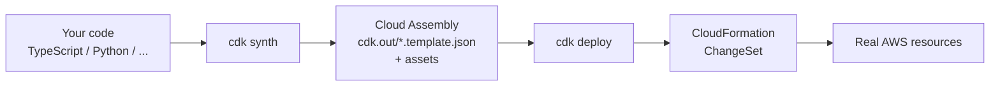

# AWS CDK — A Beginner's Guide

## Table of Contents

1. [What is AWS CDK?](#what-is-aws-cdk)
2. [Why use CDK instead of raw CloudFormation?](#why-use-cdk-instead-of-raw-cloudformation)
3. [How CDK works (the synth pipeline)](#how-cdk-works-the-synth-pipeline)
4. [Core concepts](#core-concepts)
5. [Installing and setting up](#installing-and-setting-up)
6. [Your first CDK app, step by step](#your-first-cdk-app-step-by-step)
7. [Project layout](#project-layout)
8. [The CDK CLI commands you will actually use](#the-cdk-cli-commands-you-will-actually-use)
9. [Constructs in depth (L1, L2, L3)](#constructs-in-depth-l1-l2-l3)
10. [Worked examples](#worked-examples)
11. [Passing values around: props, outputs, and tokens](#passing-values-around-props-outputs-and-tokens)
12. [Environments, accounts, and regions](#environments-accounts-and-regions)
13. [Context, parameters, and configuration](#context-parameters-and-configuration)
14. [Assets: bundling code and Docker images](#assets-bundling-code-and-docker-images)
15. [Permissions and IAM the CDK way](#permissions-and-iam-the-cdk-way)
16. [Removal policies and stateful resources](#removal-policies-and-stateful-resources)
17. [Testing your infrastructure](#testing-your-infrastructure)
18. [CI/CD with CDK Pipelines](#cicd-with-cdk-pipelines)
19. [Aspects, tagging, and governance](#aspects-tagging-and-governance)
20. [Escape hatches](#escape-hatches)
21. [Common errors and how to fix them](#common-errors-and-how-to-fix-them)
22. [Best practices checklist](#best-practices-checklist)
23. [Glossary](#glossary)
24. [Where to go next](#where-to-go-next)
25. [Appendix: Windows-native setup runbook](#appendix-windows-native-setup-runbook)

---

## What is AWS CDK?

The **AWS Cloud Development Kit (CDK)** is an open-source software development framework that lets you define cloud infrastructure using a general-purpose programming language, and provision it through **AWS CloudFormation**.

Instead of hand-writing hundreds of lines of YAML or JSON, you write ordinary code:

```typescript
const bucket = new s3.Bucket(this, 'MyBucket', {
  versioned: true,
  encryption: s3.BucketEncryption.S3_MANAGED,
});
```

CDK turns that into a CloudFormation template and deploys it for you.

**Supported languages:** TypeScript, JavaScript, Python, Java, C#/.NET, and Go. TypeScript is the language CDK itself is written in, so it usually gets features first and has the most examples online. This guide uses TypeScript for the main examples and shows Python equivalents where helpful.

**Current version:** CDK **v2** is the supported version. All stable AWS service libraries ship in a single package, `aws-cdk-lib`. (CDK v1 reached end-of-support in June 2023 — do not start new projects on it.)

---

## Why use CDK instead of raw CloudFormation?

| Problem with raw templates                               | How CDK solves it                                                        |
| -------------------------------------------------------- | ------------------------------------------------------------------------ |
| YAML has no loops, functions, or types                   | Use`for` loops, functions, classes, and generics                       |
| Copy-pasting the same 200 lines for every microservice   | Write a reusable construct class once, instantiate it many times         |
| Easy to typo a property name and find out at deploy time | Compiler and IDE autocomplete catch it before you deploy                 |
| Wiring IAM policies by hand is verbose and error-prone   | `bucket.grantRead(myLambda)` writes the least-privilege policy for you |
| No unit tests for infrastructure                         | Use Jest/pytest against the synthesized template                         |
| Hard to share logic across teams                         | Publish constructs to npm / PyPI / Maven / NuGet                         |

**Concrete comparison.** A Lambda function that can read from an S3 bucket.

*CloudFormation YAML — and this is already the abbreviated version:*

```yaml
Resources:
  MyBucket:
    Type: AWS::S3::Bucket
  MyFunctionRole:
    Type: AWS::IAM::Role
    Properties:
      AssumeRolePolicyDocument:
        Version: '2012-10-17'
        Statement:
          - Effect: Allow
            Principal: { Service: lambda.amazonaws.com }
            Action: sts:AssumeRole
      ManagedPolicyArns:
        - arn:aws:iam::aws:policy/service-role/AWSLambdaBasicExecutionRole
  MyFunctionPolicy:
    Type: AWS::IAM::Policy
    Properties:
      PolicyName: ReadBucket
      Roles: [!Ref MyFunctionRole]
      PolicyDocument:
        Version: '2012-10-17'
        Statement:
          - Effect: Allow
            Action: ['s3:GetObject*', 's3:GetBucket*', 's3:List*']
            Resource:
              - !GetAtt MyBucket.Arn
              - !Sub '${MyBucket.Arn}/*'
  MyFunction:
    Type: AWS::Lambda::Function
    Properties:
      Runtime: nodejs20.x
      Handler: index.handler
      Role: !GetAtt MyFunctionRole.Arn
      Code: { S3Bucket: my-artifacts, S3Key: fn.zip }
      Environment:
        Variables:
          BUCKET_NAME: !Ref MyBucket
```

*The same thing in CDK:*

```typescript
const bucket = new s3.Bucket(this, 'MyBucket');

const fn = new lambda.Function(this, 'MyFunction', {
  runtime: lambda.Runtime.NODEJS_20_X,
  handler: 'index.handler',
  code: lambda.Code.fromAsset('lambda'),
  environment: { BUCKET_NAME: bucket.bucketName },
});

bucket.grantRead(fn);
```

Six lines of meaningful code replace roughly forty lines of YAML, and the IAM policy is generated correctly.

**When *not* to use CDK:** if your team has no programming experience and only needs a handful of static resources, plain CloudFormation or Terraform may be simpler. CDK's power comes from abstraction and reuse.

---

## How CDK works (the synth pipeline)



Four things to internalize as a beginner:

1. **Your code runs once, at synthesis time.** It is *not* running in AWS. It is a program whose output is a JSON template. An `if` statement in your code is evaluated on your laptop, not at deploy time.
2. **`cdk.out/` is build output.** It contains one `.template.json` per stack, plus zipped Lambda code and Docker image metadata. It is generated — add it to `.gitignore`.
3. **CloudFormation does the actual work.** Rollbacks, drift detection, change sets, and stack states all come from CloudFormation. When a deploy fails, read the CloudFormation events.
4. **Logical IDs are auto-generated.** CDK hashes the construct path to produce something like `MyBucketABC12345`. If you rename or move a construct in the tree, the logical ID changes, and CloudFormation will **delete the old resource and create a new one**. This is the single most common way beginners lose data.

---

## Core concepts

### App

The root of your application. Everything lives inside it.

```typescript
const app = new cdk.App();
```

### Stack

A unit of deployment that maps 1:1 to a CloudFormation stack. Stacks have hard limits (500 resources), so split large systems into multiple stacks.

```typescript
class MyStack extends cdk.Stack {
  constructor(scope: Construct, id: string, props?: cdk.StackProps) {
    super(scope, id, props);
    // resources go here
  }
}
```

### Construct

The basic building block. Every CDK class — a bucket, a VPC, a whole stack — is a construct. Constructs form a tree.

Every construct takes the same three arguments:

```typescript
new SomeConstruct(scope, id, props)
```

- **`scope`** — the parent. Inside a stack you pass `this`.
- **`id`** — a string unique among siblings. Used to build the logical ID. **Changing it replaces the resource.**
- **`props`** — an options object.

### The construct tree

```
App
└── MyStack
    ├── MyBucket
    │   └── Resource            <- the underlying CfnBucket
    └── MyFunction
        ├── ServiceRole
        │   ├── Resource
        │   └── DefaultPolicy
        └── Resource
```

The path `MyStack/MyFunction/ServiceRole/Resource` is what CDK hashes to make the logical ID. You will see these paths in `cdk diff` output and error messages.

### Environment

The account + region a stack deploys to.

```typescript
new MyStack(app, 'Prod', { env: { account: '123456789012', region: 'us-east-1' } });
```

---

## Installing and setting up

### 1. Prerequisites

- **Node.js 18 or later** — required even if you write CDK in Python, Java, or Go, because the CDK CLI is a Node program.
- **Python 3.9 or later** — if you plan to write your CDK code in Python. Check with `python --version`.
- **AWS CLI** configured with credentials: `aws configure`
- Verify with `aws sts get-caller-identity` — it should print your account ID.

### 2. Install the CDK CLI

```bash
npm install -g aws-cdk
cdk --version
```

> Instead of a global install you can use `npx aws-cdk@latest ...` to pin a version per project. Mismatched CLI and library versions are a common source of confusing errors.

### 3. Set up a Python virtual environment

Skip this step if you are using TypeScript. If you are using Python, **do this before anything else** — it is the step beginners most often skip, and skipping it causes the majority of "it works on my machine" problems.

#### Why a virtual environment matters

A **virtual environment** (venv) is a private, self-contained folder holding its own copy of the Python interpreter and its own `site-packages` directory. When it is active, `python` and `pip` resolve to that folder instead of the system-wide Python.

Without one, every `pip install` writes into a single global `site-packages` shared by every project on your machine. That causes four concrete problems:

| Problem                                   | What actually happens                                                                                                                                                                                                                                                                                                                                                                      |
| ----------------------------------------- | ------------------------------------------------------------------------------------------------------------------------------------------------------------------------------------------------------------------------------------------------------------------------------------------------------------------------------------------------------------------------------------------ |
| **Version conflicts**               | Project A needs`aws-cdk-lib==2.100.0`, Project B needs `2.170.0`. Only one can be installed globally. Installing B's version silently breaks A, and you find out when `cdk synth` throws an import error.                                                                                                                                                                            |
| **Unreproducible builds**           | Your`requirements.txt` says `aws-cdk-lib>=2.0`, but you happen to have `2.170.0` installed locally while the CI server (the machine that runs your automated build — GitHub Actions, CodeBuild, Jenkins) installs `2.180.0`. The two machines synthesize different CloudFormation templates from the same source. A deploy that passed on your laptop then fails in the pipeline. |
| **Polluted / broken system Python** | On macOS and many Linux distros, the OS itself depends on the system Python.`pip install` into it can break system tooling. Modern Python even blocks this with an `externally-managed-environment` error.                                                                                                                                                                             |
| **No clean uninstall**              | Deleting a project leaves dozens of its dependencies behind globally, forever. With a venv you just delete the`.venv` folder.                                                                                                                                                                                                                                                            |

There is a CDK-specific reason too: **your CDK code runs on your machine during `cdk synth`**. The exact version of `aws-cdk-lib` installed determines what CloudFormation template gets generated. Two developers with different library versions can produce different templates from identical source code — and therefore deploy different infrastructure. A venv plus a pinned `requirements.txt` is what makes synthesis deterministic.

#### Do you need Python installed first?

**Yes.** A virtual environment is not a separate download and it does not include Python — it is created *by* an existing Python installation. `venv` is a module built into the Python standard library (3.3+), which is why the command is `python -m venv` ("run the `venv` module using this Python").

Mechanically, `python -m venv .venv` copies or symlinks the interpreter you invoked it with into `.venv/`, then gives it a fresh, empty `site-packages`. So the venv inherits its Python version from whatever created it: run it with Python 3.12 and you get a 3.12 environment. You cannot create a 3.12 venv using a 3.9 installation.

**Check whether you already have it:**

```powershell
python --version
```

If that prints `Python 3.9.x` or newer, you are ready. Some systems need `python3` instead:

```bash
python3 --version
```

Common results and what they mean:

| Output                                      | Meaning                                                                                                                                |
| ------------------------------------------- | -------------------------------------------------------------------------------------------------------------------------------------- |
| `Python 3.12.4`                           | Good — proceed to create the venv.                                                                                                    |
| `Python 2.7.18`                           | Too old. Python 2 is end-of-life; install Python 3 and use the`python3` command.                                                     |
| `'python' is not recognized...` (Windows) | Not installed, or not on`PATH`.                                                                                                      |
| Opens the Microsoft Store (Windows)         | The Store stub is intercepting the command. Install real Python, or disable the alias under Settings → Apps → App execution aliases. |
| `command not found` (macOS/Linux)         | Not installed, or only`python3` exists.                                                                                              |

**Installing Python if you do not have it:**

| Platform                        | How                                                                                                                                                                                                                                                                                     |
| ------------------------------- | --------------------------------------------------------------------------------------------------------------------------------------------------------------------------------------------------------------------------------------------------------------------------------------- |
| **Windows**               | Download the installer from[python.org/downloads](https://www.python.org/downloads/). **Tick "Add python.exe to PATH"** on the first screen — forgetting this is the #1 cause of `'python' is not recognized`. Or use a package manager: `winget install Python.Python.3.12`. |
| **macOS**                 | `brew install python@3.12`. Do not rely on the Apple-supplied system Python; it is there for the OS, and newer macOS versions removed it from the command line entirely.                                                                                                              |
| **Linux (Debian/Ubuntu)** | `sudo apt install python3 python3-venv python3-pip`. The `python3-venv` package is separate on Debian/Ubuntu — without it, `python -m venv` fails with `ensurepip is not available`.                                                                                           |
| **Linux (Fedora/RHEL)**   | `sudo dnf install python3 python3-pip`                                                                                                                                                                                                                                                |

After installing on Windows, **close and reopen your terminal** so it picks up the updated `PATH`.

> **Version note:** CDK's Python support requires **Python 3.9 or later**. If you need several versions side by side (one project on 3.9, another on 3.12), use a version manager — `pyenv` on macOS/Linux, or the bundled `py` launcher on Windows, which lets you pick explicitly:
>
> ```powershell
> py -3.12 -m venv .venv
> ```

You do **not** need to install anything extra for `venv` itself on Windows or macOS — it ships with Python. Debian/Ubuntu is the exception noted in the table above.

#### Creating and activating a venv

```bash
# 1. Create it (the trailing ".venv" is the folder name, by convention)
python -m venv .venv
```

Activate it. The command differs by shell:

```powershell
# Windows — PowerShell
.venv\Scripts\Activate.ps1
```

```bat
:: Windows — cmd.exe
.venv\Scripts\activate.bat
```

```bash
# macOS / Linux — bash or zsh
source .venv/bin/activate
```

You will know it worked because your prompt gets a prefix:

```
(.venv) PS C:\Users\Owner\hello-cdk>
```

Verify you are pointing at the venv, not the system Python:

```powershell
# Windows PowerShell
(Get-Command python).Source
# -> C:\Users\Owner\hello-cdk\.venv\Scripts\python.exe
```

```bash
# macOS / Linux
which python
# -> /Users/you/hello-cdk/.venv/bin/python
```

To leave the environment:

```bash
deactivate
```

> **Windows PowerShell gotcha:** if activation fails with `running scripts is disabled on this system`, allow local scripts for your user:
>
> ```powershell
> Set-ExecutionPolicy -Scope CurrentUser -ExecutionPolicy RemoteSigned
> ```
>
> This only affects your user account, not the whole machine.

#### Installing CDK dependencies

With the venv **active**:

```bash
python -m pip install --upgrade pip
pip install -r requirements.txt       # cdk init generates this file
pip install -r requirements-dev.txt   # pytest and friends, if present
```

A fresh CDK Python project's `requirements.txt` looks like this:

```text
aws-cdk-lib==2.180.0
constructs>=10.0.0,<11.0.0
```

> **Pin `aws-cdk-lib` to an exact version** (`==`, not `>=`). This is the single most effective thing you can do to keep synth reproducible across your laptop, your teammates' laptops, and CI.

After adding a new dependency, freeze the exact set so others can reproduce it:

```bash
pip install boto3
pip freeze > requirements.txt
```

#### Project hygiene

Add the venv to `.gitignore` — never commit it. It contains machine-specific absolute paths and is often hundreds of megabytes.

```gitignore
.venv/
__pycache__/
*.pyc
.pytest_cache/
cdk.out/
```

Commit `requirements.txt` instead. That file, not the venv folder, is the portable description of your environment. A teammate reproduces your setup with three commands:

```bash
git clone <repo> && cd <repo>
python -m venv .venv && .venv\Scripts\Activate.ps1
pip install -r requirements.txt
```

#### Tell VS Code about it

VS Code usually detects `.venv` automatically. If it does not, or IntelliSense cannot resolve `aws_cdk`:

1. Press `Ctrl+Shift+P` → **Python: Select Interpreter**
2. Choose the one whose path contains `.venv`

Then open a **new** terminal — VS Code activates the selected interpreter automatically in new terminals, so the `(.venv)` prefix appears without you typing the activate command.

#### Everyday rules

- **Activate before every session.** A new terminal window starts deactivated. Running `cdk synth` outside the venv gives `ModuleNotFoundError: No module named 'aws_cdk'`.
- **One venv per project.** Do not share a single venv across repos; that recreates the conflicts you were avoiding.
- **Never `sudo pip install`.** If you feel the need to, you forgot to activate.
- **The venv is disposable.** If it gets into a weird state, `rm -rf .venv` (PowerShell: `Remove-Item -Recurse -Force .venv`) and rebuild it from `requirements.txt`.

#### Alternatives you may encounter

`venv` + `pip` is the standard-library approach and is what `cdk init` sets up, so it is the right default. You may see these in other projects:

| Tool             | Notes                                                                                                                                                      |
| ---------------- | ---------------------------------------------------------------------------------------------------------------------------------------------------------- |
| **uv**     | Very fast drop-in replacement.`uv venv` then `uv pip install -r requirements.txt`. Fully compatible with a normal `.venv`.                           |
| **Poetry** | Manages venv + dependency resolution + lockfile via`pyproject.toml`. Requires adapting the `cdk.json` `app` command to `poetry run python app.py`. |
| **pipenv** | Similar idea with`Pipfile`/`Pipfile.lock`. Less common now.                                                                                            |
| **conda**  | Common in data science. Works, but mixes conda and pip package sources, which can get messy.                                                               |

Whichever you pick, `cdk.json` must invoke the interpreter that has `aws-cdk-lib` installed:

```json
{
  "app": "python app.py"
}
```

That plain `python` resolves correctly **only when the venv is active** — another reason activation is a habit worth building.

#### Walkthrough: Ubuntu on WSL, from scratch

This is the complete sequence on a fresh Ubuntu install under Windows Subsystem for Linux. Every command is run **inside** the WSL terminal, not PowerShell.

**Step 0 — Know which filesystem you are on**

WSL gives you **two separate hard drives** that both appear in the same directory tree:

| Path                           | What it really is                  | Speed |
| ------------------------------ | ---------------------------------- | ----- |
| `/mnt/c/...`                 | Your Windows`C:` drive, borrowed | Slow  |
| `/home/<you>/...` (or `~`) | Linux's own drive                  | Fast  |

Check where you are:

```bash
pwd
df -T .     # "9p" = Windows drive, "ext4" = Linux drive
```

Think of `/mnt/c/` as a shared folder over a network. Linux cannot talk to the Windows drive directly, so every single file operation — open, read, write, check-if-exists — becomes a message passed between two operating systems. One file, no problem. But `npm install` creates tens of thousands of small files, and `cdk synth` reads and writes thousands more. Multiply a tiny delay by 50,000 and a five-second command becomes a two-minute one.

The Linux drive has no such middleman, so it runs at full speed. Two other things also only work properly there: real Unix file permissions (`chmod` is silently ignored on `/mnt/c`), and file-change watching, which tools like `cdk watch` rely on.

**The rule is symmetric — it is about crossing, not about which drive is "better":**

> **Keep files on the same side as the tools that touch them most.**

| Files live on            | Tools you run        | Result                          |
| ------------------------ | -------------------- | ------------------------------- |
| Linux (`~`)            | Linux (WSL)          | ✅ Fast                         |
| Windows (`C:\`)        | Windows (PowerShell) | ✅ Fast                         |
| Windows (`C:\`)        | Linux (WSL)          | ❌ Slow — crossing             |
| Linux (`\\wsl$\...`) | Windows (PowerShell) | ❌ Slow — crossing the other way |

Slowness is not a property of the Windows drive. A Windows repo driven by Windows tools is perfectly fast. It only degrades when one side has to reach across to the other. So the question is never "is this a Linux project?" — it is **"which shell will I be typing commands into?"** Put the files there.

**Exceptions where `/mnt/c/` is still the right home:**

- Files you regularly open in Windows applications (Excel, Photoshop, a Windows-only editor).
- Repos you only read or edit, never build — notes, docs, config. A few markdown files will not notice.
- Very large media or datasets you do not want to duplicate; read them over `/mnt/c` rather than copying gigabytes.

For anything you **build** — `npm install`, `pip install`, compile, test, `cdk synth` — the Linux side wins by a wide margin.

Move the project across:

```bash
mkdir -p ~/repos && cd ~/repos
git clone <your-repo-url>
cd <your-repo>
df -T .     # confirm it now says ext4
```

You are not losing access to your files. The Linux drive shows up in Windows Explorer at `\\wsl$\Ubuntu\home\<user>\`, and `code .` opens it in VS Code exactly as before.

> **Open the project through the WSL remote, not as a Windows folder.** Install the **WSL** extension (`ms-vscode-remote.remote-wsl`), then run `code .` from the WSL terminal. The bottom-left corner should read **WSL: Ubuntu** in green. Opening `\\wsl$\...` as a normal Windows folder puts VS Code on the far side of the boundary again, which reintroduces the slowness and prevents Python from finding your venv.

**Step 1 — Update the package index**

```bash
sudo apt update && sudo apt upgrade -y
```

A stale index is the cause of most "package has no installation candidate" errors.

**Step 2 — Check what Python you have**

Ubuntu ships with Python 3 preinstalled, but it is deliberately minimal:

```bash
python3 --version
```

Note it is `python3`, not `python`. On Ubuntu the bare `python` command does not exist by default — that is intentional, to avoid ambiguity with the long-dead Python 2.

**Step 3 — Install the pieces Ubuntu leaves out**

```bash
sudo apt install -y python3-venv python3-pip
```

This is the step people miss. Debian and Ubuntu split the standard library across packages, so `venv` and `pip` are **not** included with the base `python3`. Without `python3-venv` you get:

```
The virtual environment was not created successfully because ensurepip is not available.
```

**Step 4 — Install Node.js (the CDK CLI needs it)**

The version in Ubuntu's own repositories is usually too old. Use NodeSource:

```bash
curl -fsSL https://deb.nodesource.com/setup_20.x | sudo -E bash -
sudo apt install -y nodejs
node --version    # should print v20.x
```

**Step 5 — Install the CDK CLI**

```bash
sudo npm install -g aws-cdk
cdk --version
```

> To avoid `sudo` for global npm packages, point npm at a directory you own:
>
> ```bash
> mkdir -p ~/.npm-global
> npm config set prefix '~/.npm-global'
> echo 'export PATH=~/.npm-global/bin:$PATH' >> ~/.bashrc
> source ~/.bashrc
> npm install -g aws-cdk
> ```

**Step 6 — Install the AWS CLI v2**

Do **not** use `sudo apt install awscli`. That package was AWS CLI v1 and has been removed from Ubuntu 24.04+, which produces:

```
E: Package 'awscli' has no installation candidate
```

Use AWS's official installer instead:

```bash
sudo apt install -y unzip curl
curl "https://awscli.amazonaws.com/awscli-exe-linux-x86_64.zip" -o "awscliv2.zip"
unzip awscliv2.zip
sudo ./aws/install
rm -rf awscliv2.zip aws/
aws --version
```

On ARM hardware substitute `awscli-exe-linux-aarch64.zip`. Check which you need with `uname -m` (`x86_64` vs `aarch64`).

**Step 7 — Configure credentials**

```bash
aws configure
aws sts get-caller-identity
```

> WSL and Windows have **separate** home directories, so credentials configured in PowerShell are invisible to WSL. If you already set them up on the Windows side, share them instead of re-entering:
>
> ```bash
> ln -s /mnt/c/Users/Owner/.aws ~/.aws
> ```

**Step 8 — Create and activate the virtual environment**

```bash
cd ~/repos/my-cdk-project
python3 -m venv .venv
source .venv/bin/activate
```

Your prompt now shows the `(.venv)` prefix. Confirm the interpreter really is the local one:

```bash
which python
# /home/owner/repos/my-cdk-project/.venv/bin/python
```

Inside an active venv, plain `python` works even though Ubuntu has no system-wide `python` — the venv creates that alias for you.

**Step 9 — Install project dependencies**

```bash
python -m pip install --upgrade pip
pip install -r requirements.txt
```

**Step 10 — Verify end to end**

```bash
cdk --version
python -c "import aws_cdk; print(aws_cdk.__version__)"
cdk synth
```

**Step 11 — Set up Docker (only if you bundle assets)**

Needed for `PythonFunction`, `DockerImageAsset`, and `DockerImageFunction`. `NodejsFunction` uses esbuild and needs no Docker.

You have two choices, and you only need one:

- **Docker Engine natively in Ubuntu** — `sudo apt install docker.io`. Lighter, no Windows GUI.
- **Docker Desktop on Windows** — then enable **Settings → Resources → WSL Integration** for your distro so the `docker` command works inside WSL.

Either way, add yourself to the `docker` group so CDK can call Docker without a password prompt:

```bash
groups | grep -q docker && echo "already in docker group" || sudo usermod -aG docker $USER
```

Then **close and reopen the WSL terminal** — group membership is only read at login — and test:

```bash
docker run --rm hello-world
```

This matters because CDK invokes Docker internally during `cdk synth`. It cannot answer a `sudo` password prompt, so without group membership the synth simply fails.

**Step 12 — Bootstrap, then deploy**

```bash
cdk bootstrap
cdk deploy
```

Common WSL-specific failures:

| Symptom                                            | Cause                                    | Fix                                                                              |
| -------------------------------------------------- | ---------------------------------------- | -------------------------------------------------------------------------------- |
| `ensurepip is not available`                     | `python3-venv` not installed           | `sudo apt install python3-venv`                                                |
| `Package 'awscli' has no installation candidate` | Removed from Ubuntu 24.04+               | Use the official v2 installer (Step 6)                                           |
| `python: command not found` outside a venv       | Ubuntu only provides`python3`          | Use`python3`, or `sudo apt install python-is-python3`                        |
| Everything is extremely slow                       | Project lives under`/mnt/c/`           | Move it to`~/` (Step 0)                                                        |
| `aws` works in PowerShell but not WSL            | Separate installs and separate home dirs | Install the CLI inside WSL too (Step 6)                                          |
| `Unable to locate credentials`                   | `~/.aws` is empty in WSL               | `aws configure` in WSL, or symlink (Step 7)                                    |
| `permission denied` on the Docker socket         | Not in the`docker` group               | `sudo usermod -aG docker $USER`, then reopen the terminal (Step 11)            |
| `docker: command not found` in WSL               | Docker Desktop WSL integration disabled  | Docker Desktop → Settings → Resources → WSL Integration → enable your distro |

#### Running multiple environments with different packages

A venv is just a folder. Nothing stops you from having many, each with a completely different set of packages — that is the entire point.

**The normal case: one venv per project**

```bash
~/repos/
├── project-alpha/
│   ├── .venv/                 # aws-cdk-lib 2.100.0, boto3 1.28
│   └── requirements.txt
├── project-beta/
│   ├── .venv/                 # aws-cdk-lib 2.180.0, boto3 1.35
│   └── requirements.txt
└── data-analysis/
    ├── .venv/                 # pandas, numpy, no CDK at all
    └── requirements.txt
```

Each is isolated. Installing into one cannot affect another:

```bash
cd ~/repos/project-alpha
python3 -m venv .venv && source .venv/bin/activate
pip install aws-cdk-lib==2.100.0
deactivate

cd ~/repos/project-beta
python3 -m venv .venv && source .venv/bin/activate
pip install aws-cdk-lib==2.180.0
deactivate
```

Verify they genuinely differ:

```bash
source ~/repos/project-alpha/.venv/bin/activate && pip show aws-cdk-lib | grep Version
# Version: 2.100.0
deactivate

source ~/repos/project-beta/.venv/bin/activate && pip show aws-cdk-lib | grep Version
# Version: 2.180.0
deactivate
```

**Switching between them**

Only one venv is active per shell at a time. Activating a second one while the first is active mostly works but leaves `PATH` messy — deactivate first:

```bash
deactivate                                   # leave the current one
source ~/repos/project-beta/.venv/bin/activate
```

Two terminal tabs can hold two *different* active venvs simultaneously, which is handy when working across projects. Activation only modifies environment variables in that one shell.

**Several venvs for the same project**

Useful for testing a library upgrade without disturbing your working setup:

```bash
cd ~/repos/my-cdk-project

python3 -m venv .venv                    # current, known-good
python3 -m venv .venv-next               # experiment

source .venv-next/bin/activate
pip install aws-cdk-lib==2.190.0
cdk synth > /tmp/next.json

deactivate && source .venv/bin/activate
cdk synth > /tmp/current.json

diff /tmp/current.json /tmp/next.json     # did the upgrade change my infrastructure?
```

That `diff` is a genuinely useful CDK habit: it shows exactly what a library upgrade does to your CloudFormation before you deploy it. Add `.venv*` to `.gitignore` so extra environments are never committed.

**Different Python versions per environment**

The venv inherits its version from the interpreter that created it, so install the versions you need and pick explicitly:

```bash
sudo add-apt-repository ppa:deadsnakes/ppa
sudo apt update
sudo apt install -y python3.11 python3.11-venv python3.12 python3.12-venv

python3.11 -m venv .venv-py311
python3.12 -m venv .venv-py312
```

For more than a couple of versions, `pyenv` is cleaner — it builds and manages them for you:

```bash
curl https://pyenv.run | bash
# then follow the printed instructions to update ~/.bashrc

pyenv install 3.11.9
pyenv install 3.12.4
pyenv local 3.12.4          # writes .python-version, auto-selects in this directory
python -m venv .venv
```

**Separating dev tools from runtime dependencies**

Keep the split in two files rather than two environments:

`requirements.txt` — what the app needs:

```text
aws-cdk-lib==2.180.0
constructs>=10.0.0,<11.0.0
```

`requirements-dev.txt` — what only developers need:

```text
-r requirements.txt
pytest==8.3.2
black==24.8.0
mypy==1.11.2
```

```bash
pip install -r requirements-dev.txt    # dev machine: pulls in both files
pip install -r requirements.txt        # CI/deploy: runtime only
```

The leading `-r requirements.txt` line makes the dev file include the runtime file, so versions never drift apart.

**Listing and cleaning up**

```bash
# What is installed in the active environment?
pip list
pip freeze                       # exact pinned versions, suitable for requirements.txt

# Which environments exist?
find ~/repos -maxdepth 2 -name ".venv*" -type d

# How much disk are they using?
du -sh ~/repos/*/.venv

# Delete one — it is completely disposable
rm -rf ~/repos/old-project/.venv
```

Because every environment is reconstructible from `requirements.txt`, deleting a `.venv` loses nothing. Rebuild any time with:

```bash
python3 -m venv .venv && source .venv/bin/activate && pip install -r requirements.txt
```

**A shortcut worth knowing**

Typing the activate path repeatedly gets old. Add an alias to `~/.bashrc`:

```bash
echo "alias venv='source .venv/bin/activate'" >> ~/.bashrc
source ~/.bashrc
```

Now `cd` into any project and just type `venv`.

### 4. Bootstrap your account

CDK needs a small amount of supporting infrastructure in each account/region pair: an S3 bucket for assets, an ECR repo for Docker images, and some IAM roles. This is a **one-time** step per account+region.

```bash
cdk bootstrap aws://123456789012/us-east-1
```

Or, using your current CLI profile:

```bash
cdk bootstrap
```

This creates a stack called `CDKToolkit`. If you skip it, deploys fail with `This stack uses assets, so the toolkit stack must be deployed to the environment`.

---

## Your first CDK app, step by step

### Step 1 — Create the project

```bash
mkdir hello-cdk && cd hello-cdk
cdk init app --language typescript
```

For Python — `cdk init` creates the `.venv` folder for you, but does **not** activate it:

```powershell
cdk init app --language python
.venv\Scripts\Activate.ps1      # macOS/Linux: source .venv/bin/activate
pip install -r requirements.txt
```

> `cdk init` requires an empty directory. It also runs `git init` for you.
>
> If you are new to virtual environments, read [Set up a Python virtual environment](#3-set-up-a-python-virtual-environment) first — activation is required in every new terminal.

### Step 2 — Write a stack

`lib/hello-cdk-stack.ts`:

```typescript
import * as cdk from 'aws-cdk-lib';
import * as s3 from 'aws-cdk-lib/aws-s3';
import { Construct } from 'constructs';

export class HelloCdkStack extends cdk.Stack {
  constructor(scope: Construct, id: string, props?: cdk.StackProps) {
    super(scope, id, props);

    new s3.Bucket(this, 'MyFirstBucket', {
      versioned: true,
      encryption: s3.BucketEncryption.S3_MANAGED,
      blockPublicAccess: s3.BlockPublicAccess.BLOCK_ALL,
      removalPolicy: cdk.RemovalPolicy.DESTROY, // dev only
      autoDeleteObjects: true,                  // dev only
    });
  }
}
```

Python equivalent:

```python
import aws_cdk as cdk
from aws_cdk import aws_s3 as s3
from constructs import Construct


class HelloCdkStack(cdk.Stack):
    def __init__(self, scope: Construct, id: str, **kwargs) -> None:
        super().__init__(scope, id, **kwargs)

        s3.Bucket(
            self, "MyFirstBucket",
            versioned=True,
            encryption=s3.BucketEncryption.S3_MANAGED,
            block_public_access=s3.BlockPublicAccess.BLOCK_ALL,
            removal_policy=cdk.RemovalPolicy.DESTROY,
            auto_delete_objects=True,
        )
```

### Step 3 — Look at the generated template

```bash
cdk synth
```

You will see YAML on stdout and JSON written to `cdk.out/`. Reading this output is the fastest way to build a mental model of what CDK is doing for you.

### Step 4 — Deploy

```bash
cdk deploy
```

CDK shows the IAM changes it is about to make and asks for confirmation. Type `y`.

### Step 5 — Change something and diff

Add a lifecycle rule, then:

```bash
cdk diff
```

```
Stack HelloCdkStack
Resources
[~] AWS::S3::Bucket MyFirstBucket MyFirstBucketB8884501
 └─ [+] LifecycleConfiguration
     └─ {"Rules":[{"ExpirationInDays":30,"Status":"Enabled"}]}
```

### Step 6 — Clean up

```bash
cdk destroy
```

---

## Project layout

A typical TypeScript CDK project:

```
hello-cdk/
├── bin/
│   └── hello-cdk.ts          # entry point: creates App + Stacks
├── lib/
│   └── hello-cdk-stack.ts    # your stack definitions
├── lambda/
│   └── index.ts              # application code bundled as an asset
├── test/
│   └── hello-cdk.test.ts     # Jest tests against the synthesized template
├── cdk.json                  # tells the CLI how to run your app + feature flags
├── cdk.out/                  # generated; gitignore this
├── package.json
└── tsconfig.json
```

`bin/hello-cdk.ts`:

```typescript
#!/usr/bin/env node
import * as cdk from 'aws-cdk-lib';
import { HelloCdkStack } from '../lib/hello-cdk-stack';

const app = new cdk.App();

new HelloCdkStack(app, 'HelloCdkDev', {
  env: { account: '111111111111', region: 'us-east-1' },
});

new HelloCdkStack(app, 'HelloCdkProd', {
  env: { account: '222222222222', region: 'eu-west-1' },
});
```

`cdk.json`:

```json
{
  "app": "npx ts-node --prefer-ts-exts bin/hello-cdk.ts",
  "context": {
    "@aws-cdk/aws-iam:minimizePolicies": true
  }
}
```

The `context` block holds **feature flags**. `cdk init` fills these in for you; leave them alone unless you know exactly what a flag changes, because flipping one can cause resource replacement.

---

## The CDK CLI commands you will actually use

| Command                                | What it does                                                                                                                                 |
| -------------------------------------- | -------------------------------------------------------------------------------------------------------------------------------------------- |
| `cdk init app --language typescript` | Scaffold a new project                                                                                                                       |
| `cdk bootstrap`                      | One-time setup per account+region                                                                                                            |
| `cdk ls`                             | List stacks in the app                                                                                                                       |
| `cdk synth`                          | Generate CloudFormation templates into`cdk.out/`                                                                                           |
| `cdk diff`                           | Compare local code against what is deployed                                                                                                  |
| `cdk deploy`                         | Deploy one or more stacks                                                                                                                    |
| `cdk deploy --all`                   | Deploy every stack, in dependency order                                                                                                      |
| `cdk deploy --hotswap`               | Fast dev-loop deploy that bypasses CloudFormation for Lambda code, ECS images, Step Functions definitions.**Never use in production.** |
| `cdk watch`                          | Watch files and auto-hotswap-deploy on save                                                                                                  |
| `cdk destroy`                        | Delete stacks                                                                                                                                |
| `cdk doctor`                         | Print environment diagnostics                                                                                                                |
| `cdk context --clear`                | Wipe cached context values (VPC lookups, AMI IDs)                                                                                            |

Useful flags:

```bash
cdk deploy MyStack --require-approval never    # skip the IAM prompt in CI
cdk deploy 'Prod/*'                            # wildcard stack selection
cdk deploy --outputs-file outputs.json         # write stack outputs to a file
cdk deploy --no-rollback                       # keep failed resources while debugging
cdk synth --quiet                              # write files without printing YAML
cdk diff --context stage=prod                  # supply context on the fly
```

---

## Constructs in depth (L1, L2, L3)

### L1 — CFN resources (`Cfn*`)

Auto-generated, one-for-one mappings of CloudFormation resource types. Names always start with `Cfn`. Properties match the CloudFormation spec exactly, including required ones. No defaults, no helpers.

```typescript
new s3.CfnBucket(this, 'RawBucket', {
  bucketName: 'my-explicit-name',
  versioningConfiguration: { status: 'Enabled' },
});
```

Use L1 when a brand-new AWS feature has no L2 yet, or you need a property the L2 does not expose.

### L2 — Curated constructs

Hand-written, opinionated wrappers with sensible defaults, helper methods, and `grant*` functions. This is what you should use 95% of the time.

```typescript
const bucket = new s3.Bucket(this, 'Bucket', { versioned: true });

bucket.addLifecycleRule({ expiration: cdk.Duration.days(90) });
bucket.grantReadWrite(myRole);
bucket.addEventNotification(s3.EventType.OBJECT_CREATED, new s3n.SqsDestination(queue));
```

L2 constructs also expose useful attributes: `bucket.bucketName`, `bucket.bucketArn`, `bucket.bucketWebsiteUrl`.

### L3 — Patterns

Multi-resource, opinionated solutions to a whole use case.

```typescript
import * as patterns from 'aws-cdk-lib/aws-ecs-patterns';

new patterns.ApplicationLoadBalancedFargateService(this, 'Service', {
  cpu: 512,
  memoryLimitMiB: 1024,
  desiredCount: 2,
  taskImageOptions: {
    image: ecs.ContainerImage.fromRegistry('amazon/amazon-ecs-sample'),
  },
  publicLoadBalancer: true,
});
```

Those eight lines create a VPC, an ECS cluster, a Fargate task definition, a service, an Application Load Balancer, target groups, listeners, security groups, and IAM roles — roughly 50 resources.

### Importing existing resources

You often need to reference a resource CDK did not create. Use the static `from*` methods. These return read-only references that CDK will **not** manage or delete.

```typescript
const existing = s3.Bucket.fromBucketName(this, 'Existing', 'my-legacy-bucket');
const vpc = ec2.Vpc.fromLookup(this, 'Vpc', { isDefault: true });
const secret = secretsmanager.Secret.fromSecretNameV2(this, 'Sec', 'prod/db');
```

---

## Worked examples

### Example 1 — Serverless API: API Gateway → Lambda → DynamoDB

```typescript
import * as cdk from 'aws-cdk-lib';
import * as lambda from 'aws-cdk-lib/aws-lambda';
import * as nodejs from 'aws-cdk-lib/aws-lambda-nodejs';
import * as apigw from 'aws-cdk-lib/aws-apigateway';
import * as dynamodb from 'aws-cdk-lib/aws-dynamodb';
import { Construct } from 'constructs';

export class ApiStack extends cdk.Stack {
  constructor(scope: Construct, id: string, props?: cdk.StackProps) {
    super(scope, id, props);

    const table = new dynamodb.Table(this, 'Items', {
      partitionKey: { name: 'id', type: dynamodb.AttributeType.STRING },
      billingMode: dynamodb.BillingMode.PAY_PER_REQUEST,
      removalPolicy: cdk.RemovalPolicy.RETAIN,
      pointInTimeRecovery: true,
    });

    // NodejsFunction bundles TypeScript with esbuild automatically
    const handler = new nodejs.NodejsFunction(this, 'ItemsHandler', {
      entry: 'lambda/items.ts',
      handler: 'handler',
      runtime: lambda.Runtime.NODEJS_20_X,
      memorySize: 512,
      timeout: cdk.Duration.seconds(10),
      environment: { TABLE_NAME: table.tableName },
    });

    table.grantReadWriteData(handler);

    const api = new apigw.LambdaRestApi(this, 'ItemsApi', {
      handler,
      proxy: false,
      deployOptions: { stageName: 'v1', tracingEnabled: true },
    });

    const items = api.root.addResource('items');
    items.addMethod('GET');
    items.addMethod('POST');
    items.addResource('{id}').addMethod('GET');

    new cdk.CfnOutput(this, 'ApiUrl', { value: api.url });
  }
}
```

`lambda/items.ts`:

```typescript
import { DynamoDBClient } from '@aws-sdk/client-dynamodb';
import { DynamoDBDocumentClient, ScanCommand } from '@aws-sdk/lib-dynamodb';

const ddb = DynamoDBDocumentClient.from(new DynamoDBClient({}));

export const handler = async () => {
  const res = await ddb.send(new ScanCommand({ TableName: process.env.TABLE_NAME! }));
  return { statusCode: 200, body: JSON.stringify(res.Items ?? []) };
};
```

### Example 2 — Static website: S3 + CloudFront + automated upload

```typescript
import * as s3 from 'aws-cdk-lib/aws-s3';
import * as cloudfront from 'aws-cdk-lib/aws-cloudfront';
import * as origins from 'aws-cdk-lib/aws-cloudfront-origins';
import * as s3deploy from 'aws-cdk-lib/aws-s3-deployment';

const siteBucket = new s3.Bucket(this, 'SiteBucket', {
  blockPublicAccess: s3.BlockPublicAccess.BLOCK_ALL,
  encryption: s3.BucketEncryption.S3_MANAGED,
});

const distribution = new cloudfront.Distribution(this, 'Cdn', {
  defaultRootObject: 'index.html',
  defaultBehavior: {
    // Origin Access Control keeps the bucket fully private
    origin: origins.S3BucketOrigin.withOriginAccessControl(siteBucket),
    viewerProtocolPolicy: cloudfront.ViewerProtocolPolicy.REDIRECT_TO_HTTPS,
  },
  errorResponses: [
    // SPA fallback so client-side routing works
    { httpStatus: 404, responseHttpStatus: 200, responsePagePath: '/index.html' },
  ],
});

new s3deploy.BucketDeployment(this, 'DeploySite', {
  sources: [s3deploy.Source.asset('./site/dist')],
  destinationBucket: siteBucket,
  distribution,
  distributionPaths: ['/*'], // invalidate the CDN cache on every deploy
});
```

### Example 3 — VPC and an RDS database

```typescript
import * as ec2 from 'aws-cdk-lib/aws-ec2';
import * as rds from 'aws-cdk-lib/aws-rds';

const vpc = new ec2.Vpc(this, 'Vpc', {
  maxAzs: 2,
  natGateways: 1, // NAT gateways cost real money — 1 for dev, 2+ for prod HA
  subnetConfiguration: [
    { name: 'public',   subnetType: ec2.SubnetType.PUBLIC,               cidrMask: 24 },
    { name: 'private',  subnetType: ec2.SubnetType.PRIVATE_WITH_EGRESS,  cidrMask: 24 },
    { name: 'isolated', subnetType: ec2.SubnetType.PRIVATE_ISOLATED,     cidrMask: 28 },
  ],
});

const db = new rds.DatabaseInstance(this, 'Postgres', {
  engine: rds.DatabaseInstanceEngine.postgres({
    version: rds.PostgresEngineVersion.VER_16_3,
  }),
  vpc,
  vpcSubnets: { subnetType: ec2.SubnetType.PRIVATE_ISOLATED },
  instanceType: ec2.InstanceType.of(ec2.InstanceClass.T4G, ec2.InstanceSize.MICRO),
  // CDK creates and manages a Secrets Manager secret for you
  credentials: rds.Credentials.fromGeneratedSecret('dbadmin'),
  storageEncrypted: true,
  removalPolicy: cdk.RemovalPolicy.SNAPSHOT,
});

// Opens the right security group rule in one line
db.connections.allowDefaultPortFrom(myLambda);
```

### Example 4 — Event-driven: SNS + SQS + Lambda with a dead-letter queue

```typescript
import * as sqs from 'aws-cdk-lib/aws-sqs';
import * as sns from 'aws-cdk-lib/aws-sns';
import * as subs from 'aws-cdk-lib/aws-sns-subscriptions';
import { SqsEventSource } from 'aws-cdk-lib/aws-lambda-event-sources';

const dlq = new sqs.Queue(this, 'Dlq', { retentionPeriod: cdk.Duration.days(14) });

const queue = new sqs.Queue(this, 'Work', {
  visibilityTimeout: cdk.Duration.seconds(300),
  deadLetterQueue: { queue: dlq, maxReceiveCount: 3 },
});

const topic = new sns.Topic(this, 'Events');
topic.addSubscription(new subs.SqsSubscription(queue));

const worker = new lambda.Function(this, 'Worker', {
  runtime: lambda.Runtime.PYTHON_3_12,
  handler: 'app.handler',
  code: lambda.Code.fromAsset('worker'),
  timeout: cdk.Duration.seconds(300), // must be <= the queue's visibility timeout
});

worker.addEventSource(new SqsEventSource(queue, { batchSize: 10 }));
```

### Example 5 — A reusable custom construct

This is where CDK really pays off: wrap a pattern your team repeats.

```typescript
import { Construct } from 'constructs';
import * as cdk from 'aws-cdk-lib';
import * as sqs from 'aws-cdk-lib/aws-sqs';
import * as lambda from 'aws-cdk-lib/aws-lambda';
import { SqsEventSource } from 'aws-cdk-lib/aws-lambda-event-sources';

export interface QueuedWorkerProps {
  readonly entryDir: string;
  readonly handler: string;
  readonly runtime: lambda.Runtime;
  readonly maxReceiveCount?: number;
  readonly timeout?: cdk.Duration;
}

export class QueuedWorker extends Construct {
  public readonly queue: sqs.Queue;
  public readonly deadLetterQueue: sqs.Queue;
  public readonly function: lambda.Function;

  constructor(scope: Construct, id: string, props: QueuedWorkerProps) {
    super(scope, id);

    const timeout = props.timeout ?? cdk.Duration.seconds(60);

    this.deadLetterQueue = new sqs.Queue(this, 'Dlq', {
      retentionPeriod: cdk.Duration.days(14),
    });

    this.queue = new sqs.Queue(this, 'Queue', {
      visibilityTimeout: timeout,
      deadLetterQueue: {
        queue: this.deadLetterQueue,
        maxReceiveCount: props.maxReceiveCount ?? 3,
      },
    });

    this.function = new lambda.Function(this, 'Fn', {
      runtime: props.runtime,
      handler: props.handler,
      code: lambda.Code.fromAsset(props.entryDir),
      timeout,
    });

    this.function.addEventSource(new SqsEventSource(this.queue));
  }
}
```

Now every worker in your organization is a few lines and correct by construction:

```typescript
const thumbnails = new QueuedWorker(this, 'Thumbnails', {
  entryDir: 'workers/thumbnails',
  handler: 'app.handler',
  runtime: lambda.Runtime.PYTHON_3_12,
});

bucket.grantRead(thumbnails.function);
```

And because it is just code, you can loop:

```typescript
for (const name of ['thumbnails', 'transcode', 'notify']) {
  new QueuedWorker(this, `Worker-${name}`, {
    entryDir: `workers/${name}`,
    handler: 'app.handler',
    runtime: lambda.Runtime.PYTHON_3_12,
  });
}
```

---

## Passing values around: props, outputs, and tokens

### Within a stack — just use variables

```typescript
const bucket = new s3.Bucket(this, 'B');
fn.addEnvironment('BUCKET', bucket.bucketName);
```

### Between stacks — pass object references through props

This is the recommended approach. CDK automatically creates the CloudFormation `Export`/`Fn::ImportValue` pair and orders the deployments.

```typescript
// lib/storage-stack.ts
export class StorageStack extends cdk.Stack {
  public readonly bucket: s3.Bucket;

  constructor(scope: Construct, id: string, props?: cdk.StackProps) {
    super(scope, id, props);
    this.bucket = new s3.Bucket(this, 'Data');
  }
}

// lib/compute-stack.ts
interface ComputeStackProps extends cdk.StackProps {
  readonly bucket: s3.IBucket;
}

export class ComputeStack extends cdk.Stack {
  constructor(scope: Construct, id: string, props: ComputeStackProps) {
    super(scope, id, props);
    const fn = new lambda.Function(this, 'Fn', { /* ... */ });
    props.bucket.grantRead(fn);
  }
}

// bin/app.ts
const storage = new StorageStack(app, 'Storage');
new ComputeStack(app, 'Compute', { bucket: storage.bucket });
```

> **Gotcha — the "deadly embrace":** once stack A exports a value that stack B imports, you cannot delete or change that resource in A until B stops importing it. If you hit this, deploy in two steps: first change B to stop using the value, then change A.

### Stack outputs

```typescript
new cdk.CfnOutput(this, 'ApiUrl', {
  value: api.url,
  description: 'Base URL of the REST API',
  exportName: 'MyApiUrl', // only add exportName if another stack imports it
});
```

### Tokens — why you cannot `console.log` a bucket name

At synth time, `bucket.bucketName` is not a string like `"my-bucket-123"`. It is a **token**: a placeholder like `${Token[TOKEN.42]}` that becomes `{ "Ref": "MyBucketABC123" }` in the template and a real value only at deploy time.

```typescript
const name = bucket.bucketName;

console.log(name);              // ${Token[TOKEN.42]} — not useful
console.log(name.length);       // meaningless
if (name === 'prod-bucket') {}  // never true

// Correct: string interpolation works, CDK resolves it later
new cdk.CfnOutput(this, 'Msg', { value: `Bucket is ${bucket.bucketName}` });

// Correct: detect an unresolved value
if (cdk.Token.isUnresolved(name)) { /* deploy-time value */ }
```

**Rule of thumb:** you can *concatenate* tokens into strings, but you cannot *inspect* them. If you need to branch on a value, it must be known at synth time (from context, an env var, or a constant).

---

## Environments, accounts, and regions

```typescript
const app = new cdk.App();

// 1. Environment-agnostic — deploys anywhere, but Vpc.fromLookup and similar
//    lookups will NOT work, and AZ lists fall back to 2 AZs.
new MyStack(app, 'Agnostic');

// 2. Inherit from whatever profile the CLI is using
new MyStack(app, 'FromCli', {
  env: {
    account: process.env.CDK_DEFAULT_ACCOUNT,
    region: process.env.CDK_DEFAULT_REGION,
  },
});

// 3. Explicit — required for lookups and for multi-account pipelines
new MyStack(app, 'Prod', {
  env: { account: '222222222222', region: 'eu-west-1' },
});
```

**Prefer explicit environments** for anything beyond a toy project.

A common multi-environment pattern using a config object:

```typescript
interface StageConfig {
  readonly env: cdk.Environment;
  readonly instanceSize: ec2.InstanceSize;
  readonly minCapacity: number;
  readonly deletionProtection: boolean;
}

const stages: Record<string, StageConfig> = {
  dev: {
    env: { account: '111111111111', region: 'us-east-1' },
    instanceSize: ec2.InstanceSize.MICRO,
    minCapacity: 1,
    deletionProtection: false,
  },
  prod: {
    env: { account: '222222222222', region: 'us-east-1' },
    instanceSize: ec2.InstanceSize.LARGE,
    minCapacity: 3,
    deletionProtection: true,
  },
};

for (const [name, cfg] of Object.entries(stages)) {
  new AppStack(app, `App-${name}`, cfg);
}
```

---

## Context, parameters, and configuration

There are three ways to get values into a CDK app. They are **not** interchangeable.

### 1. Context — synth-time, recommended

Values available while your code runs, so you can branch on them.

```bash
cdk deploy --context stage=prod
```

```typescript
const stage = this.node.tryGetContext('stage') ?? 'dev';
const isProd = stage === 'prod';

new dynamodb.Table(this, 'T', {
  partitionKey: { name: 'pk', type: dynamodb.AttributeType.STRING },
  removalPolicy: isProd ? cdk.RemovalPolicy.RETAIN : cdk.RemovalPolicy.DESTROY,
  pointInTimeRecovery: isProd,
});
```

Context can also live in `cdk.json` or `cdk.context.json`. **Commit `cdk.context.json`** — it caches VPC/AMI lookups so your synth is reproducible.

### 2. CloudFormation Parameters — deploy-time, generally avoid

```typescript
const p = new cdk.CfnParameter(this, 'Stage', { type: 'String', default: 'dev' });
// p.valueAsString is a token — you CANNOT write: if (p.valueAsString === 'prod')
```

Because parameter values are unknown at synth time, they defeat most of CDK's advantages. AWS guidance is to prefer context.

### 3. SSM Parameter Store / Secrets Manager

```typescript
// Resolved at SYNTH time — the literal value is baked into the template
const amiId = ssm.StringParameter.valueFromLookup(this, '/my/ami-id');

// Resolved at DEPLOY time — the template holds a dynamic reference
const cfg = ssm.StringParameter.valueForStringParameter(this, '/my/config');

// Secrets: never resolved into the template at all
const secret = secretsmanager.Secret.fromSecretNameV2(this, 'S', 'prod/db');
fn.addEnvironment('DB_SECRET_ARN', secret.secretArn);
secret.grantRead(fn);
```

> **Never** put a plaintext secret in a Lambda `environment` block. It ends up in the CloudFormation template, in `cdk.out/`, and probably in git.

---

## Assets: bundling code and Docker images

### File and directory assets

```typescript
// Zips the directory and uploads it to the bootstrap bucket
code: lambda.Code.fromAsset('lambda')
```

Use `path.join(__dirname, '../lambda')` rather than a bare relative path — the relative path resolves against the process working directory, not the source file.

### Bundled assets (compile during synth)

```typescript
// TypeScript — esbuild runs automatically, no Docker needed
new nodejs.NodejsFunction(this, 'Fn', {
  entry: 'src/handler.ts',
  bundling: { minify: true, sourceMap: true, externalModules: ['@aws-sdk/*'] },
});

// Python — pip install runs inside a Docker container
new pylambda.PythonFunction(this, 'PyFn', {
  entry: 'src/py_handler',   // must contain requirements.txt
  index: 'app.py',
  handler: 'handler',
  runtime: lambda.Runtime.PYTHON_3_12,
});
```

`aws-cdk-lib/aws-lambda-python-alpha` requires Docker to be running locally.

### Docker image assets

```typescript
const image = new ecrAssets.DockerImageAsset(this, 'Image', {
  directory: path.join(__dirname, '../app'),
  platform: ecrAssets.Platform.LINUX_AMD64, // important on Apple Silicon
});

taskDefinition.addContainer('web', {
  image: ecs.ContainerImage.fromDockerImageAsset(image),
});
```

Or a container-based Lambda:

```typescript
new lambda.DockerImageFunction(this, 'Fn', {
  code: lambda.DockerImageCode.fromImageAsset('app'),
  memorySize: 2048,
});
```

---

## Permissions and IAM the CDK way

Prefer `grant*` methods over hand-written policies. They produce least-privilege policies and get the resource ARNs right — including the object-level `/*` ARN that people forget.

```typescript
bucket.grantRead(fn);
bucket.grantWrite(fn);
bucket.grantReadWrite(fn);
bucket.grantPut(fn);
bucket.grantDelete(fn);

table.grantReadData(fn);
table.grantWriteData(fn);
table.grantReadWriteData(fn);
table.grantStreamRead(fn);

queue.grantSendMessages(fn);
queue.grantConsumeMessages(fn);

topic.grantPublish(fn);
secret.grantRead(fn);
key.grantEncryptDecrypt(fn);
otherFn.grantInvoke(fn);
```

When there is no `grant*` for what you need, add a statement explicitly:

```typescript
fn.addToRolePolicy(new iam.PolicyStatement({
  effect: iam.Effect.ALLOW,
  actions: ['bedrock:InvokeModel'],
  resources: [`arn:aws:bedrock:${this.region}::foundation-model/anthropic.claude-*`],
  conditions: { StringEquals: { 'aws:RequestedRegion': this.region } },
}));
```

Custom roles:

```typescript
const role = new iam.Role(this, 'TaskRole', {
  assumedBy: new iam.ServicePrincipal('ecs-tasks.amazonaws.com'),
  managedPolicies: [
    iam.ManagedPolicy.fromAwsManagedPolicyName('CloudWatchAgentServerPolicy'),
  ],
});
```

> Avoid `resources: ['*']` and wildcard actions like `s3:*`. If you add `cdk-nag` (below), it flags these automatically.

---

## Removal policies and stateful resources

This is the part beginners most often get wrong, and the part that loses data.

```typescript
new s3.Bucket(this, 'Data', {
  removalPolicy: cdk.RemovalPolicy.RETAIN,   // keep the bucket if the stack is deleted
});

new dynamodb.Table(this, 'Table', {
  partitionKey: { name: 'pk', type: dynamodb.AttributeType.STRING },
  removalPolicy: cdk.RemovalPolicy.RETAIN,
});

new rds.DatabaseInstance(this, 'Db', {
  /* ... */
  removalPolicy: cdk.RemovalPolicy.SNAPSHOT, // take a final snapshot first
});
```

| Policy                         | Behavior on stack delete or resource replacement                |
| ------------------------------ | --------------------------------------------------------------- |
| `RETAIN`                     | Resource is left in the account, orphaned from the stack        |
| `DESTROY`                    | Resource is deleted                                             |
| `SNAPSHOT`                   | Final snapshot taken, then deleted (RDS, ElastiCache, Redshift) |
| `RETAIN_ON_UPDATE_OR_DELETE` | Retain in both cases                                            |

**Defaults vary by construct**, so always set this explicitly on anything stateful.

Two related traps:

1. **`autoDeleteObjects: true`** adds a custom-resource Lambda that empties the bucket so it can be deleted. Convenient in dev, dangerous in prod. It requires `removalPolicy: DESTROY`.
2. **Renaming a construct ID replaces the resource.** Changing `new s3.Bucket(this, 'Data')` to `new s3.Bucket(this, 'DataBucket')` produces a new logical ID; CloudFormation creates the new bucket and deletes the old one. If you must rename, pin the old logical ID:

```typescript
const bucket = new s3.Bucket(this, 'NewName');
(bucket.node.defaultChild as s3.CfnBucket).overrideLogicalId('DataABC12345');
```

Also worth enabling on production stacks:

```typescript
new MyStack(app, 'Prod', { terminationProtection: true });
```

---

## Testing your infrastructure

CDK ships `aws-cdk-lib/assertions` for asserting against the synthesized template.

### Fine-grained assertions

```typescript
import * as cdk from 'aws-cdk-lib';
import { Template, Match } from 'aws-cdk-lib/assertions';
import { ApiStack } from '../lib/api-stack';

test('table is on-demand and retained', () => {
  const stack = new ApiStack(new cdk.App(), 'Test');
  const template = Template.fromStack(stack);

  template.hasResourceProperties('AWS::DynamoDB::Table', {
    BillingMode: 'PAY_PER_REQUEST',
  });

  template.hasResource('AWS::DynamoDB::Table', { DeletionPolicy: 'Retain' });
  template.resourceCountIs('AWS::Lambda::Function', 1);
});

test('lambda receives the table name', () => {
  const template = Template.fromStack(new ApiStack(new cdk.App(), 'T'));

  template.hasResourceProperties('AWS::Lambda::Function', {
    Environment: { Variables: Match.objectLike({ TABLE_NAME: Match.anyValue() }) },
    Timeout: 10,
  });
});

test('no wildcard S3 permissions', () => {
  const template = Template.fromStack(new ApiStack(new cdk.App(), 'T'));

  for (const policy of Object.values(template.findResources('AWS::IAM::Policy'))) {
    for (const stmt of policy.Properties.PolicyDocument.Statement) {
      expect(stmt.Action).not.toContain('s3:*');
    }
  }
});
```

Useful matchers: `Match.objectLike`, `Match.arrayWith`, `Match.stringLikeRegexp`, `Match.absent`, `Match.anyValue`, `Match.not`.

### Snapshot tests

A good safety net against unintended changes; noisy when you intentionally refactor.

```typescript
test('template snapshot', () => {
  const template = Template.fromStack(new ApiStack(new cdk.App(), 'T'));
  expect(template.toJSON()).toMatchSnapshot();
});
```

Run with `npx jest`. Python users use `pytest` with `aws_cdk.assertions`.

### Validation at synth time

```typescript
if (props.minCapacity > props.maxCapacity) {
  throw new Error('minCapacity must be <= maxCapacity');
}
```

Errors thrown during synth fail fast, before anything touches AWS.

---

## CI/CD with CDK Pipelines

`CodePipeline` from `aws-cdk-lib/pipelines` builds a **self-mutating** pipeline: commit a change to the pipeline definition itself and the pipeline updates itself before deploying your app.

```typescript
import { CodePipeline, CodePipelineSource, ShellStep, ManualApprovalStep } from 'aws-cdk-lib/pipelines';

export class PipelineStack extends cdk.Stack {
  constructor(scope: Construct, id: string, props?: cdk.StackProps) {
    super(scope, id, props);

    const pipeline = new CodePipeline(this, 'Pipeline', {
      synth: new ShellStep('Synth', {
        input: CodePipelineSource.connection('my-org/my-repo', 'main', {
          connectionArn: 'arn:aws:codeconnections:us-east-1:111111111111:connection/xxxx',
        }),
        commands: ['npm ci', 'npm run build', 'npx jest', 'npx cdk synth'],
      }),
    });

    pipeline.addStage(new AppStage(this, 'Dev', {
      env: { account: '111111111111', region: 'us-east-1' },
    }));

    pipeline.addStage(
      new AppStage(this, 'Prod', { env: { account: '222222222222', region: 'us-east-1' } }),
      { pre: [new ManualApprovalStep('PromoteToProd')] },
    );
  }
}

class AppStage extends cdk.Stage {
  constructor(scope: Construct, id: string, props?: cdk.StageProps) {
    super(scope, id, props);
    new StorageStack(this, 'Storage');
    new ApiStack(this, 'Api');
  }
}
```

A **Stage** is a group of stacks deployed together as one logical unit — the natural abstraction for "one copy of my whole application."

For cross-account deploys, bootstrap the target account to trust the pipeline account:

```bash
cdk bootstrap aws://222222222222/us-east-1 \
  --trust 111111111111 \
  --cloudformation-execution-policies arn:aws:iam::aws:policy/AdministratorAccess
```

If you prefer GitHub Actions, a minimal OIDC-based workflow:

```yaml
permissions:
  id-token: write
  contents: read

jobs:
  deploy:
    runs-on: ubuntu-latest
    steps:
      - uses: actions/checkout@v4
      - uses: actions/setup-node@v4
        with: { node-version: 20, cache: npm }
      - uses: aws-actions/configure-aws-credentials@v4
        with:
          role-to-assume: arn:aws:iam::111111111111:role/GitHubActionsDeploy
          aws-region: us-east-1
      - run: npm ci
      - run: npx cdk deploy --all --require-approval never
```

---

## Aspects, tagging, and governance

### Tags

```typescript
cdk.Tags.of(app).add('Project', 'Cognitech');
cdk.Tags.of(prodStack).add('Environment', 'production');
cdk.Tags.of(bucket).remove('Project');
```

Tags propagate down the construct tree to every taggable resource.

### Aspects — visit every node in the tree

```typescript
import { IAspect, Annotations } from 'aws-cdk-lib';
import { IConstruct } from 'constructs';

class RequireBucketEncryption implements IAspect {
  visit(node: IConstruct): void {
    if (node instanceof s3.CfnBucket && !node.bucketEncryption) {
      Annotations.of(node).addError('All buckets must be encrypted');
    }
  }
}

cdk.Aspects.of(app).add(new RequireBucketEncryption());
```

`addError` fails the synth; `addWarning` only prints.

### cdk-nag

A ready-made rule pack for AWS Well-Architected and security compliance:

```bash
npm install cdk-nag
```

```typescript
import { AwsSolutionsChecks, NagSuppressions } from 'cdk-nag';

cdk.Aspects.of(app).add(new AwsSolutionsChecks({ verbose: true }));

// Suppress a rule with a documented reason
NagSuppressions.addResourceSuppressions(fn, [
  { id: 'AwsSolutions-IAM4', reason: 'AWSLambdaBasicExecutionRole is required by Lambda' },
]);
```

---

## Escape hatches

Sometimes CloudFormation supports a property that the L2 construct does not expose yet. There are three escalating options.

### 1. Reach the L1 child and set the property

```typescript
const bucket = new s3.Bucket(this, 'B');
const cfnBucket = bucket.node.defaultChild as s3.CfnBucket;

cfnBucket.accelerateConfiguration = { accelerationStatus: 'Enabled' };
```

### 2. Raw overrides (bypasses type checking entirely)

```typescript
cfnBucket.addPropertyOverride('SomeNewProperty.Nested', 'value');
cfnBucket.addOverride('Metadata.MyKey', 'MyValue');
cfnBucket.addDeletionOverride('Properties.VersioningConfiguration');
```

Path syntax uses dots for nesting and numeric indexes for arrays: `'Rules.0.Status'`.

### 3. Drop to L1 entirely

```typescript
new s3.CfnBucket(this, 'Raw', { /* full CloudFormation spec */ });
```

### Bonus: include existing CloudFormation

```typescript
import { CfnInclude } from 'aws-cdk-lib/cloudformation-include';

const tpl = new CfnInclude(this, 'Legacy', { templateFile: 'legacy.yaml' });
const legacyBucket = tpl.getResource('MyBucket') as s3.CfnBucket;
legacyBucket.versioningConfiguration = { status: 'Enabled' };
```

This is the standard path for migrating an existing CloudFormation stack into CDK incrementally.

---

## Common errors and how to fix them

| Message                                                                                           | Cause                                                        | Fix                                                                                                         |
| ------------------------------------------------------------------------------------------------- | ------------------------------------------------------------ | ----------------------------------------------------------------------------------------------------------- |
| `This stack uses assets, so the toolkit stack must be deployed`                                 | Account/region not bootstrapped                              | `cdk bootstrap aws://ACCOUNT/REGION`                                                                      |
| `Cannot retrieve value from context provider vpc-provider ... account/region are not specified` | Environment-agnostic stack doing a lookup                    | Set an explicit`env` on the stack                                                                         |
| `Cannot use resource X in a cross-environment fashion`                                          | Two stacks in different accounts/regions sharing a construct | Pass primitives (ARN strings) instead of construct objects                                                  |
| `Export ... cannot be deleted as it is in use by ...`                                           | The "deadly embrace"                                         | Two-phase deploy: remove the consumer first                                                                 |
| `UPDATE_ROLLBACK_FAILED`                                                                        | A resource could not roll back                               | CloudFormation console → Stack actions → Continue update rollback, optionally skipping the stuck resource |
| `Bucket already exists`                                                                         | Hardcoded`bucketName`                                      | Let CDK generate names; only hardcode when you truly must                                                   |
| `Maximum policy size exceeded`                                                                  | Too many`grant*` calls on one role                         | Split into multiple roles, or enable the`minimizePolicies` feature flag                                   |
| `Number of resources in stack is greater than 500`                                              | Stack too big                                                | Split into multiple stacks, or use nested stacks                                                            |
| `Cannot find asset at ...`                                                                      | Wrong relative path in`fromAsset`                          | Use`path.join(__dirname, '../lambda')`                                                                    |
| `Docker is not running`                                                                         | Bundling needs Docker                                        | Start Docker Desktop, or use`NodejsFunction` with local esbuild                                           |
| `cdk: command not found`                                                                        | CLI not installed or not on PATH                             | `npm i -g aws-cdk`, or use `npx aws-cdk`                                                                |
| `ModuleNotFoundError: No module named 'aws_cdk'`                                                | Python venv not activated in this terminal                   | Activate it:`.venv\Scripts\Activate.ps1`, then `pip install -r requirements.txt`                        |
| `'python' is not recognized` (Windows)                                                          | Python not installed, or not added to`PATH`                | Reinstall from python.org with**Add python.exe to PATH** ticked, then reopen the terminal             |
| `ensurepip is not available` (Debian/Ubuntu)                                                    | The`venv` module is packaged separately                    | `sudo apt install python3-venv`                                                                           |
| `running scripts is disabled on this system`                                                    | PowerShell execution policy blocks venv activation           | `Set-ExecutionPolicy -Scope CurrentUser -ExecutionPolicy RemoteSigned`                                    |
| `error: externally-managed-environment`                                                         | `pip install` targeting the system Python                  | Create and activate a venv instead of installing globally                                                   |
| `This CDK CLI is not compatible with the CDK library used by your application`                  | CLI older than`aws-cdk-lib`                                | `npm i -g aws-cdk@latest`                                                                                 |
| Resource unexpectedly replaced                                                                    | Construct`id` changed                                      | Always read`cdk diff` before deploying; use `overrideLogicalId` to preserve IDs                         |

**Debugging workflow when a deploy fails:**

1. Read the CDK CLI output — it usually names the failing logical ID.
2. Open CloudFormation console → your stack → **Events**, sort oldest first, and find the first `CREATE_FAILED`/`UPDATE_FAILED`. The status reason there is the real error.
3. Run `cdk synth` and inspect `cdk.out/MyStack.template.json` around that logical ID.
4. Use `cdk deploy --no-rollback` while iterating so failed resources are not torn down between attempts.

---

## Best practices checklist

**Structure**

- One construct per logical concern; compose them into stacks.
- Group resources by lifecycle: stateful (databases, buckets) in separate stacks from stateless (Lambdas, APIs). You will redeploy the stateless ones far more often.
- Keep `bin/app.ts` thin — it should only instantiate stacks and pass config.
- Use a `Stage` to represent "one full copy of the app."

**Code**

- Do not hardcode physical names unless required; let CDK generate unique ones so you can deploy multiple copies side by side.
- Never branch on a token. Branch on context or config instead.
- Mark props interfaces `readonly` and export them so consumers get type safety.
- Pin `aws-cdk-lib` and keep the CLI version in sync.

**Safety**

- Set `removalPolicy` explicitly on every stateful resource.
- Run `cdk diff` before every production deploy, and actually read it.
- Use `--require-approval` in CI to catch unexpected IAM or security-group changes.
- Enable `terminationProtection` on production stacks.
- Never commit secrets; use Secrets Manager or SSM SecureString.

**Quality**

- Write assertion tests for the properties that matter: encryption, retention, capacity.
- Add `cdk-nag` early — retrofitting compliance is painful.
- Tag everything at the `App` level for cost allocation.

**Cost awareness**

- NAT Gateways, always-on RDS instances, and idle ALBs are the usual surprise bills.
- Run `cdk destroy` on dev stacks you are not using.
- Consider `natGateways: 1` in dev, and VPC endpoints instead of NAT where possible.

---

## Glossary

| Term                            | Meaning                                                             |
| ------------------------------- | ------------------------------------------------------------------- |
| **App**                   | Root of the construct tree; the whole CDK program                   |
| **Stack**                 | Unit of deployment; maps to one CloudFormation stack                |
| **Stage**                 | A group of stacks representing one copy of the app (dev/prod)       |
| **Construct**             | Any node in the tree; the basic building block                      |
| **L1 / CFN resource**     | Direct 1:1 mapping of a CloudFormation resource (`CfnBucket`)     |
| **L2**                    | Curated construct with defaults and helpers (`Bucket`)            |
| **L3 / Pattern**          | Multi-resource solution (`ApplicationLoadBalancedFargateService`) |
| **Synthesis (`synth`)** | Running your code to produce CloudFormation templates               |
| **Cloud Assembly**        | The`cdk.out/` directory: templates + assets + metadata            |
| **Token**                 | Placeholder for a value only known at deploy time                   |
| **Asset**                 | Local file, directory, or Docker image uploaded during deploy       |
| **Bootstrap**             | One-time per account+region setup of the`CDKToolkit` stack        |
| **Logical ID**            | CloudFormation identifier derived from the construct path           |
| **Physical name**         | The actual AWS resource name/ARN after deployment                   |
| **Escape hatch**          | Technique for setting properties an L2 does not expose              |
| **Aspect**                | A visitor applied to every construct in a scope                     |
| **Feature flag**          | Entry in`cdk.json` context that changes CDK behavior              |

---

## Where to go next

- **AWS CDK Developer Guide** — https://docs.aws.amazon.com/cdk/v2/guide/
- **API Reference** — https://docs.aws.amazon.com/cdk/api/v2/
- **CDK Workshop** (hands-on tutorial) — https://cdkworkshop.com/
- **Construct Hub** (search community constructs) — https://constructs.dev/
- **CDK Patterns** — https://cdkpatterns.com/
- **GitHub repo and issues** — https://github.com/aws/aws-cdk
- **cdk-nag** — https://github.com/cdklabs/cdk-nag

---

## Appendix: Windows-native setup runbook

The main guide assumes Linux/WSL. This appendix is the equivalent sequence for running CDK **directly on Windows in PowerShell**, with no WSL involved. Use it if you prefer a single environment, or if WSL is unavailable on your machine.

### WSL vs Windows-native: choosing one

|                                         | WSL (Ubuntu)                            | Windows-native (PowerShell)             |
| --------------------------------------- | --------------------------------------- | --------------------------------------- |
| Matches Lambda's runtime (Linux)        | Yes                                     | No                                      |
| Docker bundling for Python Lambdas      | Reliable                                | Works, needs Docker Desktop             |
| Shell commands match AWS docs and blogs | Yes                                     | Must be translated                      |
| Matches CI runners (`ubuntu-latest`)  | Yes                                     | No                                      |
| Line endings, path separators           | Uniform                                 | CRLF and`\` cause occasional friction |
| Setup complexity                        | Higher (two filesystems, two tool sets) | Lower                                   |
| Speed on the Windows drive              | Slow under`/mnt/c`                    | Native                                  |

**Pick one and stay there.** The costly mistake is straddling both — half your tools in PowerShell, half in WSL, credentials in one place, a venv built for the other. Symptoms include `aws` working in one terminal but not the other, and `ModuleNotFoundError` from a venv created by the wrong interpreter.

### Step 1 — Install Node.js

Required even for Python CDK projects, because the CDK CLI is a Node program.

```powershell
winget install OpenJS.NodeJS.LTS
```

Close and reopen PowerShell, then verify:

```powershell
node --version    # v20.x or v22.x
npm --version
```

No `winget`? Download the LTS MSI from [nodejs.org](https://nodejs.org/).

### Step 2 — Install Python (only for Python CDK projects)

```powershell
winget install Python.Python.3.12
```

If you use the python.org installer instead, **tick "Add python.exe to PATH"** on the first screen.

```powershell
python --version    # Python 3.12.x
```

If this opens the Microsoft Store, the Store alias is intercepting the command. Turn it off under **Settings → Apps → Advanced app settings → App execution aliases**, then disable the `python.exe` and `python3.exe` entries.

Unlike Debian/Ubuntu, the Windows installer bundles `pip` and `venv` — nothing extra to install.

### Step 3 — Install the CDK CLI

```powershell
npm install -g aws-cdk
cdk --version
```

No `sudo` equivalent is needed; npm's global prefix on Windows is already user-writable.

### Step 4 — Install the AWS CLI v2

```powershell
winget install Amazon.AWSCLI
```

Or download the MSI from [awscli.amazonaws.com/AWSCLIV2.msi](https://awscli.amazonaws.com/AWSCLIV2.msi).

Reopen PowerShell, then:

```powershell
aws --version    # aws-cli/2.x.x Windows/...
```

### Step 5 — Configure credentials

```powershell
aws configure
aws sts get-caller-identity
```

Credentials land in `C:\Users\<you>\.aws\`.

### Step 6 — Allow venv activation in PowerShell

PowerShell blocks local scripts by default, which prevents `Activate.ps1` from running. Allow signed and local scripts for your user only:

```powershell
Set-ExecutionPolicy -Scope CurrentUser -ExecutionPolicy RemoteSigned
```

Do this once per machine. Without it, activation fails with `running scripts is disabled on this system`.

### Step 7 — Create the project and its virtual environment

```powershell
mkdir hello-cdk; cd hello-cdk
cdk init app --language typescript
```

For Python:

```powershell
cdk init app --language python
.venv\Scripts\Activate.ps1
python -m pip install --upgrade pip
pip install -r requirements.txt
```

Verify the prompt shows `(.venv)` and the interpreter is the local one:

```powershell
(Get-Command python).Source
# C:\...\hello-cdk\.venv\Scripts\python.exe
```

### Step 8 — Install Docker Desktop (optional)

Needed only for asset bundling — `PythonFunction`, `DockerImageAsset`, `DockerImageFunction`. Install [Docker Desktop](https://www.docker.com/products/docker-desktop/) and leave it running during `cdk synth`.

`NodejsFunction` bundles with esbuild and does **not** require Docker.

### Step 9 — Bootstrap and deploy

```powershell
cdk bootstrap
cdk synth
cdk deploy
```

### PowerShell command equivalents

| Task                     | Bash (WSL)                    | PowerShell                                    |
| ------------------------ | ----------------------------- | --------------------------------------------- |
| Activate venv            | `source .venv/bin/activate` | `.venv\Scripts\Activate.ps1`                |
| Deactivate               | `deactivate`                | `deactivate`                                |
| Which interpreter        | `which python`              | `(Get-Command python).Source`               |
| Delete a directory       | `rm -rf .venv`              | `Remove-Item -Recurse -Force .venv`         |
| Set an env var (session) | `export KEY=value`          | `$env:KEY = "value"`                        |
| Chain commands           | `cmd1 && cmd2`              | `cmd1; cmd2`                                |
| Current directory        | `pwd`                       | `Get-Location` or `$PWD`                  |
| List files               | `ls -la`                    | `Get-ChildItem -Force`                      |
| Show a file              | `cat file`                  | `Get-Content file`                          |
| Find text                | `grep pattern file`         | `Select-String pattern file`                |
| Make a directory tree    | `mkdir -p a/b/c`            | `New-Item -ItemType Directory -Force a\b\c` |

### Windows-specific troubleshooting

| Symptom                                        | Cause                            | Fix                                                                                                           |
| ---------------------------------------------- | -------------------------------- | ------------------------------------------------------------------------------------------------------------- |
| `running scripts is disabled on this system` | Execution policy                 | `Set-ExecutionPolicy -Scope CurrentUser -ExecutionPolicy RemoteSigned`                                      |
| `python` opens the Microsoft Store           | Store app-execution alias        | Disable the alias in Settings, or reinstall from python.org with PATH enabled                                 |
| `'cdk' is not recognized`                    | npm global bin not on PATH       | Reopen the terminal; check`npm config get prefix` is in `$env:PATH`                                       |
| `The filename or extension is too long`      | 260-character path limit         | Enable long paths:`git config --global core.longpaths true`, and set `LongPathsEnabled=1` in the registry |
| Git shows every file as modified               | CRLF vs LF line endings          | `git config --global core.autocrlf true`                                                                    |
| Docker bundling hangs                          | Docker Desktop not running       | Start Docker Desktop and retry                                                                                |
| venv activates but imports fail                | venv built by a different Python | Delete`.venv` and recreate with the intended interpreter                                                    |

### Moving between WSL and Windows later

The repo itself is portable — only the generated, gitignored directories are not.

Never share `.venv/` or `node_modules/` across the two environments. A venv hardcodes absolute interpreter paths (`Scripts\python.exe` on Windows, `bin/python` on Linux), and `node_modules` can contain natively compiled binaries. Delete and rebuild them on the other side:

```powershell
Remove-Item -Recurse -Force .venv, node_modules
```

Then recreate from `requirements.txt` and `package-lock.json`, which are committed and platform-neutral. Credentials must also be configured separately in each environment, since `C:\Users\<you>\.aws\` and `/home/<you>/.aws/` are different directories.
